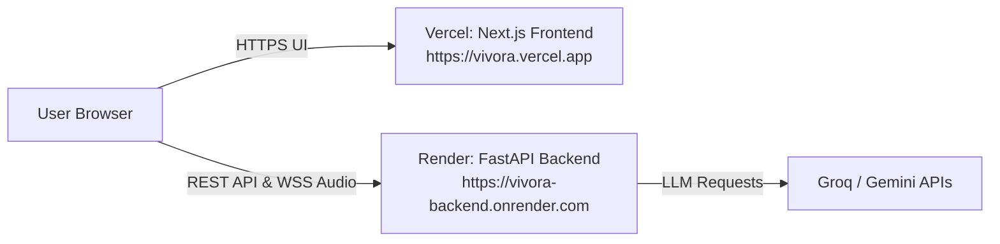

# VIVORA — 100% Free Production Deployment Guide

This guide walks you through deploying **VIVORA** completely **free** using industry-standard platforms:

| Component | Platform | Free Tier Benefits | Why Chosen |
| :--- | :--- | :--- | :--- |
| **Frontend (Next.js 15)** | **[Vercel](https://vercel.com)** | 100% Free Hobby Tier | Native Next.js support, instant CI/CD from GitHub, global edge CDN, automatic HTTPS |
| **Backend (FastAPI + WebSockets)** | **[Render](https://render.com)** | Free Web Service (512MB RAM) | Native persistent WebSocket support (`/ws/session/...`), Python 3.12, auto-deploy from GitHub |
| **Database** | **SQLite / [Neon](https://neon.tech)** | Built-in or Free Serverless Postgres | Zero cost, instant setup |

---

## Architecture Overview



---

## Step 1: Push Code to GitHub

Your repository is already connected to `https://github.com/Anu7276/VIVORA.git`.

Commit the new deployment configurations (`render.yaml`, `vercel.json`, and CORS updates):

```powershell
git add .
git commit -m "Add production deployment configs for Render and Vercel"
git push origin main
```

---

## Step 2: Deploy Backend on Render (1-Click Free Tier)

1. Go to **[dashboard.render.com](https://dashboard.render.com)** and sign in with GitHub.
2. Click **New +** > **Blueprint**.
3. Select your repository: **`Anu7276/VIVORA`**.
4. Render will automatically detect [`render.yaml`](file:///c:/Users/anura/OneDrive/Desktop/VIVORA/render.yaml) and configure the service:
   - **Service Name:** `vivora-backend`
   - **Runtime:** `Python`
   - **Root Directory:** `backend`
   - **Build Command:** `pip install -r requirements.txt`
   - **Start Command:** `uvicorn app.main:app --host 0.0.0.0 --port $PORT`
   - **Plan:** `Free`
5. Under Environment Variables in the Render dashboard, supply your API keys:
   - `GROQ_API_KEY`: *(Your Groq API Key for fast voice/LLM generation)*
   - `GEMINI_API_KEY`: *(Optional, your Google Gemini API Key)*
   - `OPENAI_API_KEY`: *(Optional, your OpenAI key if used)*
   - `JWT_SECRET_KEY`: *(Render auto-generates a secure 32+ char key if left blank)*
6. Click **Apply**.
7. Once deployed, Render will provide your public backend URL, e.g.:
   `https://vivora-backend-xxxx.onrender.com`

> **Note on Render Free Tier:** Render spins down free web services after 15 minutes of inactivity. When a new request arrives, it wakes up within ~30–50 seconds. (You can also use a free monitor like [cron-job.org](https://cron-job.org) or [UptimeRobot](https://uptimerobot.com) to ping `https://<your-backend>.onrender.com/health` every 10 minutes to keep it warm).

---

## Step 3: Deploy Frontend on Vercel (1-Click Free Tier)

1. Go to **[vercel.com](https://vercel.com)** and sign in with GitHub.
2. Click **Add New...** > **Project**.
3. Select and import **`Anu7276/VIVORA`**.
4. In the configuration screen:
   - **Framework Preset:** Next.js
   - **Root Directory:** Click `Edit` and select **`frontend`**
5. Expand **Environment Variables** and add:
   - `NEXT_PUBLIC_API_URL`: `https://<your-render-backend-url>/api`
   - `NEXT_PUBLIC_WS_URL`: `wss://<your-render-backend-url>`
   - `NEXT_PUBLIC_SITE_URL`: `https://<your-vercel-domain>.vercel.app`
6. Click **Deploy**.
7. Vercel will build and assign your live production URL (e.g. `https://vivora.vercel.app`).

---

## Step 4: Link Frontend URL back to Backend (CORS)

1. In your **Render Dashboard** for `vivora-backend`:
2. Add or update the environment variable:
   - `FRONTEND_URL`: `https://<your-vercel-domain>.vercel.app`
3. Click **Save Changes** (Render will automatically redeploy with the updated CORS origin).

---

## Alternative Free Backend Options

If you prefer an alternative to Render:
- **[Koyeb](https://www.koyeb.com)**: Free Nano instance (512MB RAM), supports WebSockets, continuous GitHub deployments with zero-config Docker or buildpack.
- **[Fly.io](https://fly.io)**: Free allowance allows running 1 shared-cpu-1x micro VM with a persistent 1GB volume (ideal for retaining `vivora.db`).
