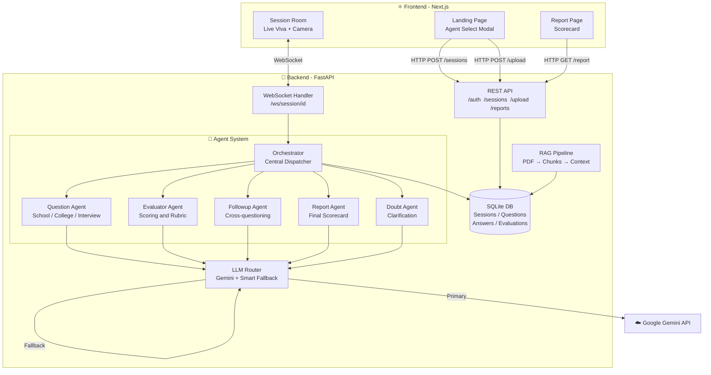
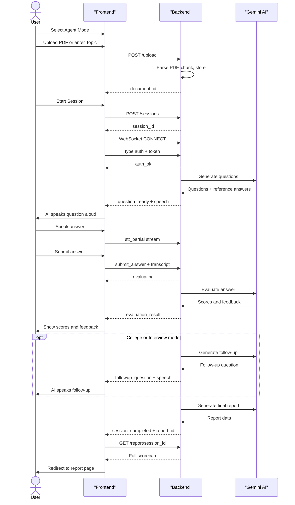
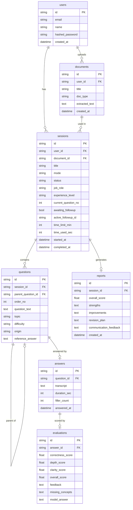
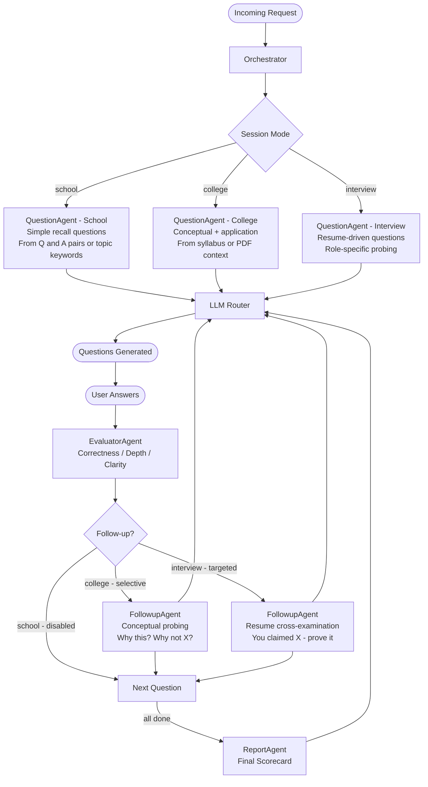
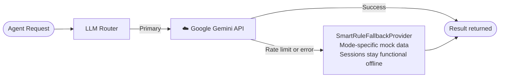
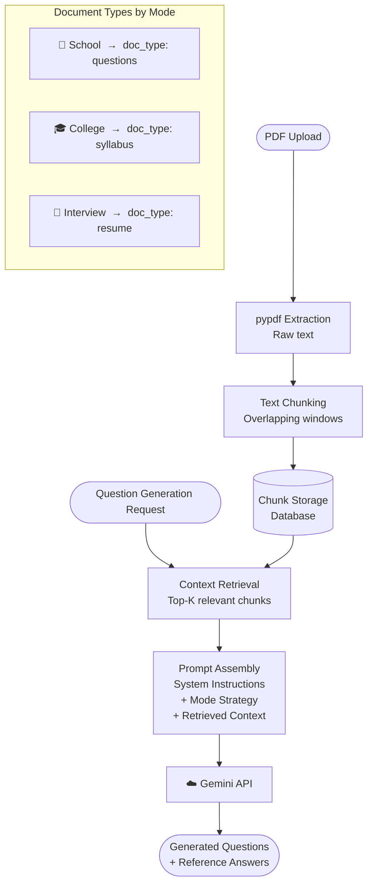
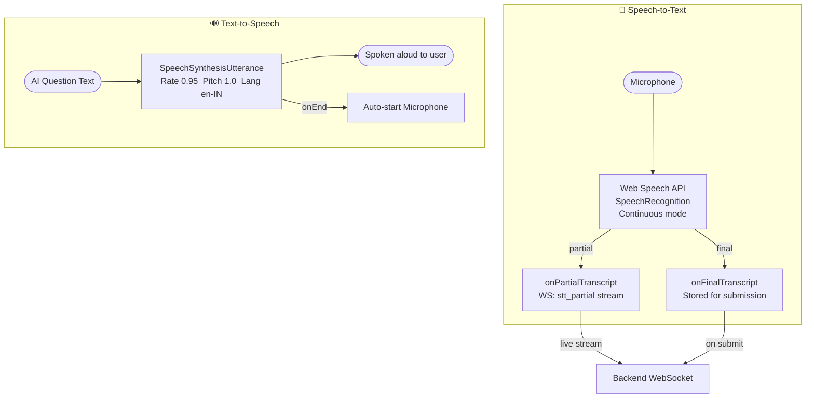
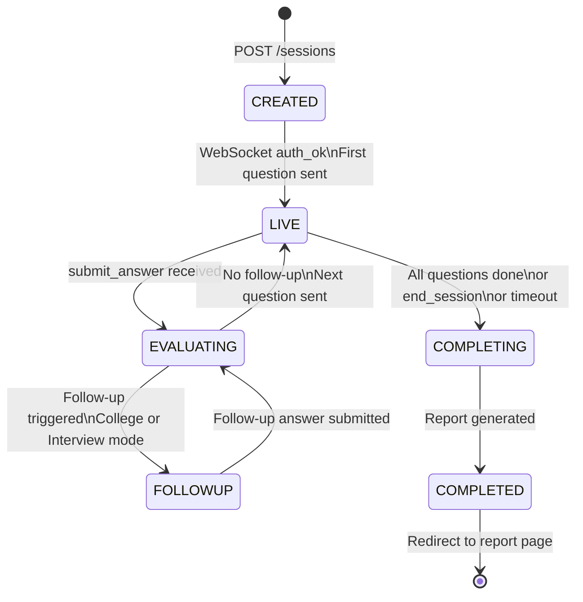

<div align="center">

# ✦ VIVORA

### *AI-Powered Viva & Interview Preparation Platform*

**Study. Practice. Speak. Improve.**

[](https://nextjs.org)
[](https://fastapi.tiangolo.com)
[](https://python.org)
[](https://sqlite.org)
[](https://developer.mozilla.org/en-US/docs/Web/API/WebSockets_API)
[](LICENSE)

</div>

---

## 📖 Table of Contents

1. [What is VIVORA?](#-what-is-vivora)
2. [The 3 AI Agents](#-the-3-ai-agents)
3. [System Architecture](#-system-architecture)
4. [Data Flow Diagram](#-data-flow-diagram)
5. [WebSocket Protocol](#-websocket-protocol)
6. [Project Structure](#-project-structure)
7. [Tech Stack](#-tech-stack)
8. [Getting Started](#-getting-started)
9. [Environment Variables](#-environment-variables)
10. [API Reference](#-api-reference)
11. [Database Schema](#-database-schema)
12. [AI Agent Routing](#-ai-agent-routing)
13. [LLM Router & Fallback](#-llm-router--fallback)
14. [RAG Pipeline](#-rag-pipeline)
15. [Voice System](#-voice-system)
16. [Session State Machine](#-session-state-machine)
17. [Deployment](#-deployment)
18. [Contributing](#-contributing)

---

## 🎯 What is VIVORA?

**VIVORA** is a full-stack, real-time AI viva and interview preparation platform. It simulates the experience of sitting in front of an examiner — asking questions, listening to your spoken answers, evaluating your responses, and probing deeper with targeted follow-up questions.

| Agent | Audience | Style |
|---|---|---|
| 🏫 **School Viva** | Class 8–12 students | Simple, foundational, encouraging |
| 🎓 **College Viva** | Undergraduate & postgraduate | Conceptual, analytical, selective cross-questioning |
| 💼 **Job Interview** | Working professionals & freshers | Resume-driven, role-specific, targeted cross-examination |

---

## 🤖 The 3 AI Agents

### 🏫 School Viva Agent
- Accepts **PDF textbooks, Q&A sheets, or typed topic names**
- Generates **foundational recall questions** — definitions, processes, facts
- Feedback is **positive and motivating** — suitable for younger students
- **No follow-up cross-questioning** — each answer moves to the next question
- *Example:* `"What is photosynthesis? Where does it take place in the cell?"`

### 🎓 College Viva Agent
- Accepts **textbook chapters, syllabus outlines, lab manuals** (PDF or text)
- Generates **conceptual and application-level questions** using Gemini AI
- Applies **selective cross-examination** — only on answers where depth matters
- Follow-up probes: *"Why this approach over X? What if Y fails instead?"*
- *Example:* `"Explain how Banker's Algorithm prevents deadlock. What are its limitations?"`

### 💼 Job Interview Agent
- Accepts **Resume PDF** + **Target Role** text input
- AI reads your actual resume and asks questions **specific to your experience**
- Applies **targeted cross-examination** on every claimed skill and project
- Supports **experience level**: Entry / Mid / Senior
- *Example:* `"You mentioned Redis — how did you handle cache invalidation at scale?"`

---

## 🏗 System Architecture



---

## 🔄 Data Flow Diagram



---

## 🔌 WebSocket Protocol

The real-time session runs over a **persistent WebSocket** at `/ws/session/{session_id}`.

### Client → Server

| `type` | Payload | Description |
|---|---|---|
| `auth` | `{ token }` | JWT auth — **must be first message within 5s** |
| `submit_answer` | `{ transcript }` | Submit spoken/typed answer for evaluation |
| `stt_partial` | `{ transcript }` | Live speech stream (continuous) |
| `replay_question` | `{}` | Re-read the current question aloud |
| `skip_question` | `{}` | Skip to the next question |
| `ask_doubt` | `{ doubt }` | Clarification request (no score penalty) |
| `end_session` | `{}` | End interview, generate final report |
| `retry_evaluation` | `{ question_id? }` | Re-evaluate last answer (max 2/question) |

### Server → Client

| `type` | Payload | Description |
|---|---|---|
| `auth_ok` | — | Authentication successful |
| `session_started` | `{ total_questions, language }` | Session initialized |
| `question_ready` | `{ question, question_index, total_questions, speech }` | New question |
| `followup_question` | `{ question, speech }` | AI-triggered follow-up probe |
| `evaluating` | `{ message }` | Evaluation in progress |
| `evaluation_result` | `{ evaluation }` | Scores + detailed feedback |
| `doubt_answered` | `{ doubt }` | Clarification response |
| `session_completed` | `{ report_id, report }` | Session finished |
| `session_timeout` | `{ message }` | Time limit reached |
| `error` | `{ code, message }` | Error details |

---

## 📁 Project Structure

```
VIVORA/
├── 📄 README.md
├── 📄 docker-compose.yml
│
├── 🐍 backend/
│   ├── 📄 requirements.txt
│   ├── 📄 Dockerfile
│   ├── 📄 .env.example
│   ├── alembic/                      # DB migrations
│   └── app/
│       ├── 📄 main.py                # FastAPI entry point + CORS
│       ├── agents/
│       │   ├── 📄 orchestrator.py    # Central dispatcher
│       │   ├── 📄 question_agent.py  # Q generation (all 3 modes)
│       │   ├── 📄 evaluator_agent.py # Scoring & rubric
│       │   ├── 📄 followup_agent.py  # Follow-up cross-questions
│       │   ├── 📄 interviewer_agent.py  # TTS turn preparation
│       │   ├── 📄 intake_agent.py    # Document ingestion & RAG
│       │   ├── 📄 doubt_agent.py     # Clarification handler
│       │   └── 📄 report_agent.py    # Final scorecard
│       ├── api/
│       │   ├── routes/               # auth / sessions / upload / reports
│       │   └── ws/
│       │       └── 📄 interview_ws.py  # WebSocket session handler
│       ├── llm/
│       │   ├── 📄 router.py          # LLM routing + fallback
│       │   └── 📄 prompts.py         # Agent-specific prompts
│       ├── rag/
│       │   └── 📄 retriever.py       # PDF chunking + retrieval
│       ├── db/
│       │   ├── 📄 database.py        # SQLAlchemy engine
│       │   └── 📄 models.py          # ORM models
│       ├── schemas/
│       │   └── 📄 ws_messages.py     # WebSocket schemas
│       ├── services/
│       │   └── 📄 session_service.py # Business logic
│       └── core/
│           └── 📄 auth.py            # JWT auth
│
└── ⚛️ frontend/
    └── src/
        ├── app/
        │   ├── 📄 page.tsx            # Landing page + modal
        │   ├── session/[id]/          # Live session room
        │   └── report/[id]/           # Scorecard report
        └── lib/
            ├── 📄 api.ts              # REST client
            ├── 📄 wsClient.ts         # WebSocket helper
            └── 📄 voice.ts            # STT + TTS client
```

---

## 🛠 Tech Stack

### Backend
| Technology | Purpose | Version |
|---|---|---|
| **FastAPI** | REST API + WebSocket server | 0.142 |
| **SQLAlchemy** | ORM & database layer | 2.0 |
| **SQLite** | Database (dev) | 3 |
| **Alembic** | Database migrations | 1.20 |
| **Pydantic** | Schemas & validation | 2.13 |
| **pypdf** | PDF text extraction | 6.19 |
| **python-jose** | JWT auth tokens | 3.4 |
| **bcrypt** | Password hashing | 4.0 |
| **uvicorn** | ASGI server | 0.54 |
| **Google Gemini** | LLM (Q generation + evaluation) | API |

### Frontend
| Technology | Purpose | Version |
|---|---|---|
| **Next.js** | React framework (App Router) | 15 |
| **TypeScript** | Type-safe code | 5 |
| **Tailwind CSS** | Styling | 3 |
| **Lucide React** | Icons | — |
| **Web Speech API** | Browser STT + TTS | Native |
| **WebSocket API** | Real-time communication | Native |
| **MediaDevices API** | Webcam capture | Native |

---

## 🚀 Getting Started

### Prerequisites
- **Node.js** ≥ 18
- **Python** ≥ 3.11
- **Google Gemini API key** — free at [ai.google.dev](https://ai.google.dev)

### 1. Clone

```bash
git clone https://github.com/Anu7276/VIVORA.git
cd VIVORA
```

### 2. Backend

```bash
cd backend

python -m venv .venv
.venv\Scripts\activate          # Windows
source .venv/bin/activate       # macOS / Linux

pip install -r requirements.txt
cp .env.example .env            # Add your GEMINI_API_KEY

alembic upgrade head
uvicorn app.main:app --host 127.0.0.1 --port 8000 --reload
```

> API: `http://localhost:8000` | Docs: `http://localhost:8000/docs`

### 3. Frontend

```bash
cd frontend
npm install
npm run dev
```

> App: `http://localhost:3000`

### 4. Docker

```bash
docker-compose up --build
```

---

## 🔐 Environment Variables

```env
GEMINI_API_KEY=your_google_gemini_api_key_here
SECRET_KEY=your_very_long_random_secret_key
ALGORITHM=HS256
ACCESS_TOKEN_EXPIRE_MINUTES=1440
DATABASE_URL=sqlite:///./vivora.db
ALLOWED_ORIGINS=http://localhost:3000
DEFAULT_TIME_LIMIT_MIN=30
MAX_QUESTIONS_PER_SESSION=9
```

---

## 📡 API Reference

| Method | Endpoint | Description |
|---|---|---|
| `POST` | `/auth/register` | Register a new user |
| `POST` | `/auth/login` | Login — returns JWT token |
| `GET` | `/auth/me` | Get current user profile |
| `POST` | `/sessions` | Create a new viva session |
| `GET` | `/sessions/id` | Get session + questions |
| `POST` | `/upload` | Upload PDF |
| `GET` | `/report/session_id` | Get final scorecard |
| `WS` | `/ws/session/id` | Live session WebSocket |

---

## 🗄 Database Schema



---

## 🧠 AI Agent Routing



---

## ⚡ LLM Router & Fallback



---

## 📚 RAG Pipeline



---

## 🎙 Voice System



> **Browser support:** Chrome ✅ | Edge ✅ | Safari ✅ | Firefox ⚠️ *(text input fallback available)*

---

## 📊 Session State Machine



---

## 🐳 Deployment

### Docker

```bash
docker-compose up --build -d
```

### Manual Production

```bash
# Backend
uvicorn app.main:app --host 0.0.0.0 --port 8000 --workers 4

# Frontend
npm run build && npm start
```

> For production: use PostgreSQL, `wss://` WebSocket, and store secrets securely.

---

## 🧪 Tests

```bash
cd backend
pytest tests/ -v
```

---

## 🤝 Contributing

1. Fork → `git checkout -b feat/your-feature`
2. Commit → `git commit -m "feat: your feature"`
3. Push → `git push origin feat/your-feature`
4. Open a Pull Request

---

## 📄 License

MIT — see [LICENSE](LICENSE)

---

<div align="center">

**Built with ❤️ for students who want to think clearly, speak confidently, and perform better under pressure.**

*✦ VIVORA — Your next answer starts here.*

</div>
