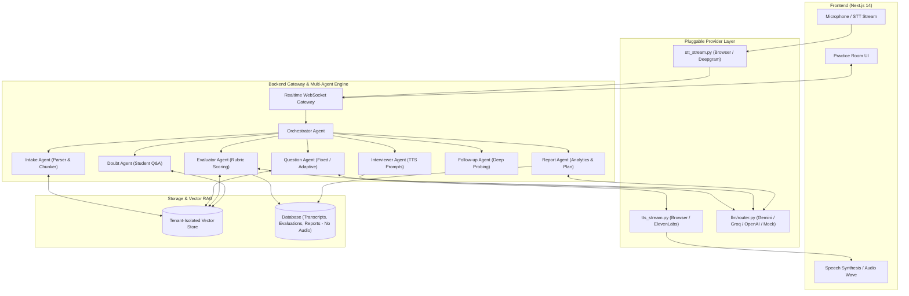

# 🎙️ VIVORA: AI Viva & Interview Simulator

> A live, voice-based AI interviewer and viva simulator. Upload a syllabus, textbook chapter, question list, or **PDF document**, answer questions aloud in real time, receive instant rubric evaluations, and get a detailed analytical revision report.

---

## 🚀 Key Features

- **3 Tailored Viva Modes**:
  - 🏫 **School Viva (Fixed)**: Friendly pace, reads uploaded questions in order, supports student voice doubts, and allows generous thinking pauses.
  - 🎓 **College Viva**: Deep probing on "why" and "how" with follow-up questions to test conceptual understanding.
  - 💼 **Interview Prep**: Adaptive difficulty, strict pacing, and communication scoring (clarity, pace, and filler tracking).
- **📄 PDF & Material Ingestion (RAG)**:
  - Drag-and-drop PDF upload or paste text/questions.
  - Automatically parses pages, extracts structured questions/topics, and embeds chunks into a **tenant-isolated in-memory Vector DB**.
- **🎙️ Real-Time Spoken Interaction**:
  - Live Voice streaming with browser Web Speech API / WebAudio visualizer waveform.
  - Text-to-Speech (TTS) spoken questions with natural pronunciation and pitch.
  - Interruption & Barge-in support (speaking interrupts AI question playback).
  - Fallback **Manual Type / Edit** mode for noisy environments or browsers without microphone support.
- **🛡️ Strict Privacy by Design**:
  - Audio is processed strictly in memory and **never saved to disk**.
  - Only transcripts, question texts, duration, and rubric evaluations are stored in the database.
- **📊 Comprehensive Performance Scorecard**:
  - Real-time scoring on **Correctness**, **Depth**, and **Speech Clarity**.
  - Summary scorecard with overall grade, key strengths, and prioritized **Revision Plan**.
  - Question-by-question breakdown comparing student transcripts against RAG model answers.
- **🔌 Pluggable Provider Architecture**:
  - Swap LLM (`Gemini`, `Groq`, `OpenAI`, or zero-cost smart fallback), STT (`Browser`, `Deepgram`, `Whisper`), and TTS (`Browser`, `ElevenLabs`, `EdgeTTS`) without modifying agent logic.

---

## 🏗️ Multi-Agent Architecture



---

## 📂 Project Structure

```
VIVORA/
├── backend/
│   ├── app/
│   │   ├── agents/          # Multi-agent workers
│   │   │   ├── base.py
│   │   │   ├── orchestrator.py
│   │   │   ├── intake_agent.py
│   │   │   ├── question_agent.py
│   │   │   ├── interviewer_agent.py
│   │   │   ├── evaluator_agent.py
│   │   │   ├── doubt_agent.py
│   │   │   ├── followup_agent.py
│   │   │   └── report_agent.py
│   │   ├── api/             # REST routes & WebSocket Gateway
│   │   │   ├── routes/
│   │   │   │   ├── upload.py    # Text & PDF file upload
│   │   │   │   ├── session.py   # Session lifecycle
│   │   │   │   └── report.py    # Scorecard retrieval
│   │   │   └── ws/
│   │   │       └── interview_ws.py  # Live WebSocket loop
│   │   ├── core/            # Config, security, guardrails
│   │   ├── db/              # SQLAlchemy models & database connection
│   │   ├── llm/             # Pluggable LLM router & prompts
│   │   ├── rag/             # PDF parser, chunker, embedder, vector store
│   │   ├── services/        # Session state machine & ModeStrategy
│   │   ├── voice/           # STT stream, TTS stream, VAD & barge-in
│   │   └── main.py          # FastAPI application entrypoint
│   ├── tests/               # End-to-end integration tests
│   ├── requirements.txt
│   └── .env.example
├── frontend/
│   ├── src/
│   │   ├── app/
│   │   │   ├── page.tsx            # Setup, mode picker & PDF dropzone
│   │   │   ├── session/[id]/       # Live voice viva room
│   │   │   ├── report/[id]/        # Analytical scorecard & revision plan
│   │   │   ├── layout.tsx
│   │   │   └── globals.css
│   │   ├── components/      # AudioWave visualizer, Navbar
│   │   └── lib/             # API client, Web Speech voice helper
│   ├── package.json
│   ├── tailwind.config.js
│   └── tsconfig.json
└── README.md
```

---

## ⚡ Quick Start


### 1. Prerequisites
- **Python 3.11+**
- **Node.js 18+** & **npm**

---

### 2. Backend Setup

```bash
# Navigate to backend directory
cd backend

# Create & activate virtual environment (Windows PowerShell)
python -m venv .venv
.\.venv\Scripts\activate

# Install dependencies
pip install -r requirements.txt

# Start FastAPI server on port 8000
python -m uvicorn app.main:app --port 8000 --host 127.0.0.1 --reload
```

- **Swagger API Docs**: [http://127.0.0.1:8000/docs](http://127.0.0.1:8000/docs)
- **API Health Check**: [http://127.0.0.1:8000/health](http://127.0.0.1:8000/health)

---

### 3. Frontend Setup

```bash
# In a new terminal, navigate to frontend directory
cd frontend

# Install packages
npm install

# Start Next.js development server on port 3000
npm run dev
```

- **Web Application**: [http://localhost:3000](http://localhost:3000)

---

### 4. Running Automated Tests

```bash
cd backend
.\.venv\Scripts\activate
# Test the complete end-to-end vertical slice
python tests/test_school_fixed_slice.py
# Test PDF parser
python tests/test_pdf_upload.py
```

---

## ⚙️ Configuration (`backend/.env`)

You can create a `.env` file inside the `backend/` directory to configure cloud AI models:

```ini
# LLM Provider: 'mock' (default zero-cost fallback), 'gemini', 'groq', 'openai'
LLM_PROVIDER=mock
GEMINI_API_KEY=your_gemini_api_key
GROQ_API_KEY=your_groq_api_key
OPENAI_API_KEY=your_openai_api_key

# Voice Providers: 'browser' (default), 'deepgram', 'elevenlabs'
STT_PROVIDER=browser
TTS_PROVIDER=browser
DEEPGRAM_API_KEY=your_deepgram_api_key
ELEVENLABS_API_KEY=your_elevenlabs_api_key

# Database
DATABASE_URL=sqlite:///./vivora.db
```

---

## 🛡️ Privacy & Security Highlights

1. **In-Memory Audio Processing**: Audio stream frames and mic inputs are processed strictly in RAM and are never persisted to disk or cloud object stores.
2. **Tenant-Isolated Vector Store**: Ingestion chunks are partitioned by document/tenant IDs, preventing any data cross-contamination between users.
3. **Guardrails**: Prompt injection defenses and input sanitization protect the agents from adversarial inputs embedded in uploaded documents.

---

## 📄 License

MIT License © 2026 VIVORA AI
