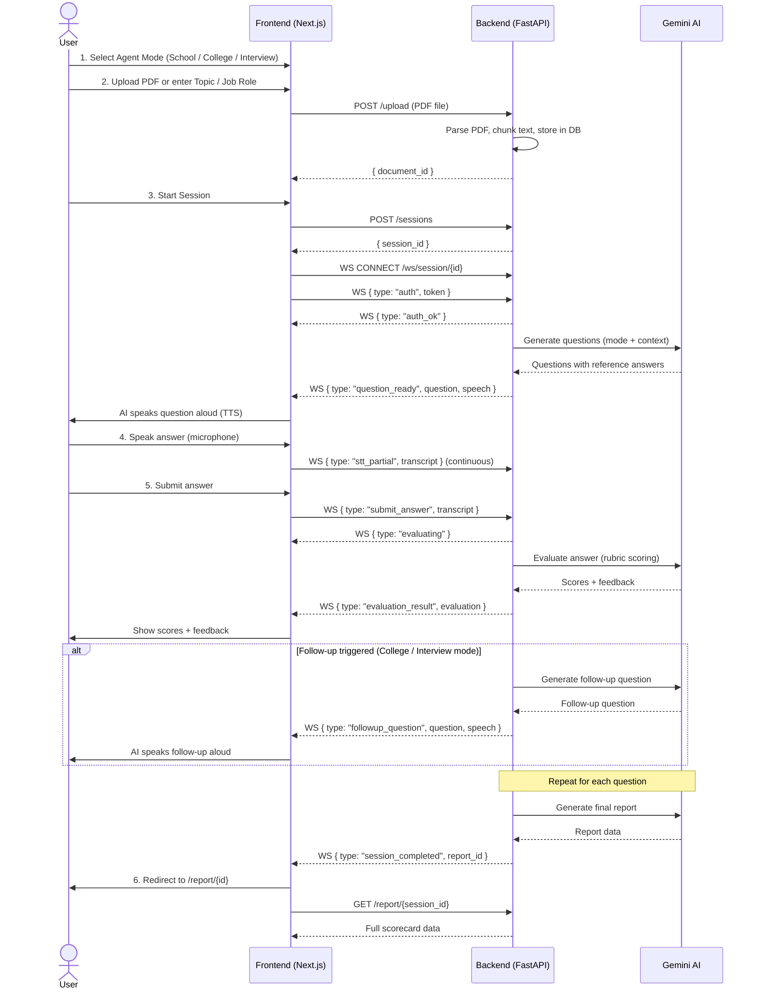
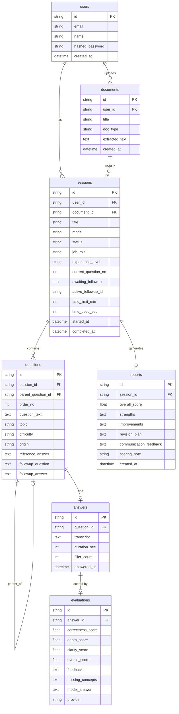
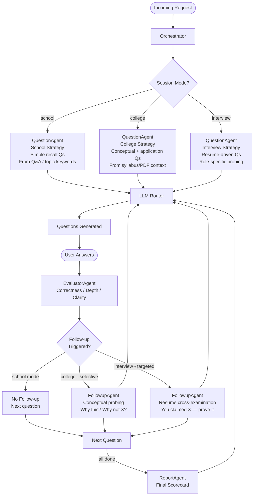
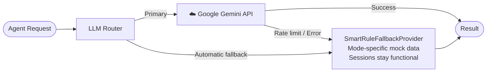
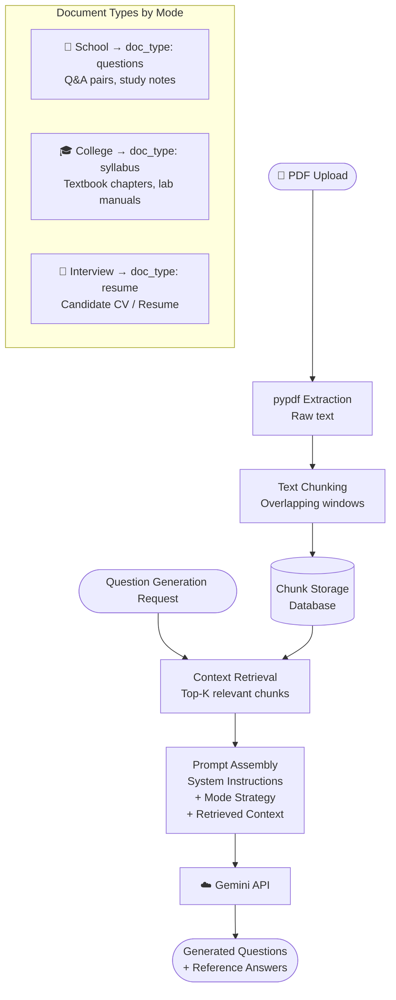
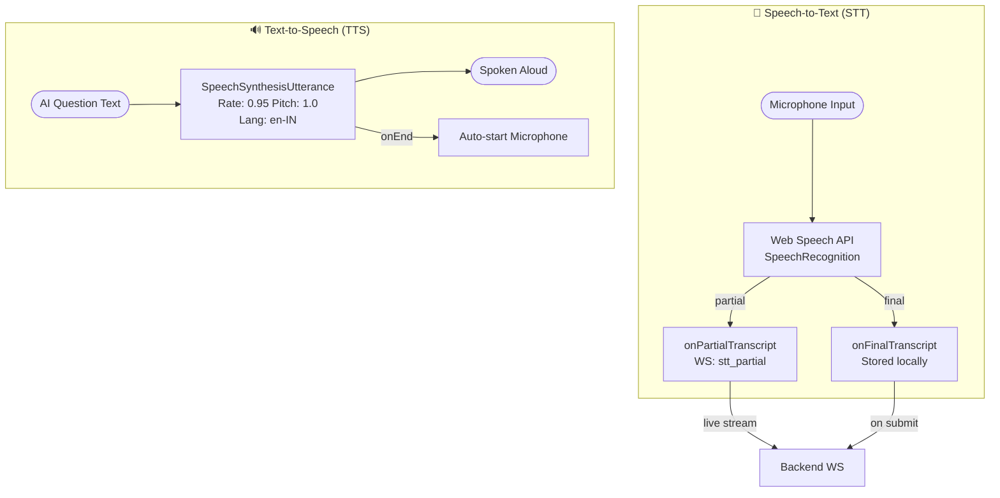
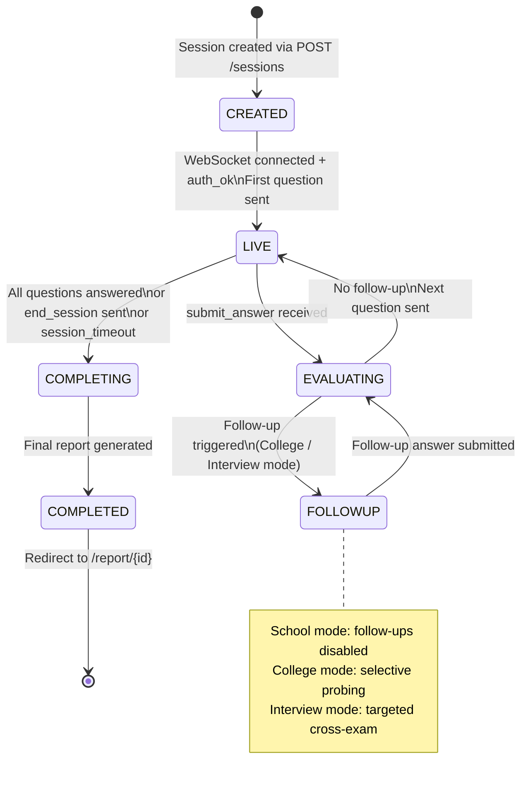

<div align="center">

# ✦ VIVORA

### *AI-Powered Viva & Interview Preparation Platform*

**Study. Practice. Speak. Improve.**

[](https://nextjs.org)
[](https://fastapi.tiangolo.com)
[](https://python.org)
[](https://sqlite.org)
[](https://developer.mozilla.org/en-US/docs/Web/API/WebSockets_API)
[](LICENSE)

</div>

---

## 📖 Table of Contents

1. [What is VIVORA?](#-what-is-vivora)
2. [The 3 AI Agents](#-the-3-ai-agents)
3. [System Architecture](#-system-architecture)
4. [Data Flow Diagram](#-data-flow-diagram)
5. [WebSocket Protocol](#-websocket-protocol)
6. [Project Structure](#-project-structure)
7. [Tech Stack](#-tech-stack)
8. [Getting Started](#-getting-started)
9. [Environment Variables](#-environment-variables)
10. [API Reference](#-api-reference)
11. [Database Schema](#-database-schema)
12. [AI Agent Routing](#-ai-agent-routing)
13. [LLM Router & Fallback](#-llm-router--fallback)
14. [RAG Pipeline](#-rag-pipeline)
15. [Voice System](#-voice-system)
16. [Session State Machine](#-session-state-machine)
17. [Deployment](#-deployment)
18. [Contributing](#-contributing)

---

## 🎯 What is VIVORA?

**VIVORA** is a full-stack, real-time AI viva and interview preparation platform. It simulates the experience of sitting in front of an examiner — asking questions, listening to your spoken answers, evaluating your responses, and probing deeper with targeted follow-up questions.

VIVORA supports **three distinct AI agents** tailored for different audiences:

| Agent | Audience | Style |
|---|---|---|
| 🏫 **School Viva** | Class 8–12 students | Simple, foundational, encouraging |
| 🎓 **College Viva** | Undergraduate & postgraduate | Conceptual, analytical, selective cross-questioning |
| 💼 **Job Interview** | Working professionals & freshers | Resume-driven, role-specific, targeted cross-examination |

---

## 🤖 The 3 AI Agents

### 🏫 School Viva Agent
- Accepts **PDF textbooks, Q&A sheets, or typed topic names**
- Generates **foundational recall questions** — definitions, processes, facts
- Feedback is **positive and motivating** — suitable for younger students
- **No follow-up cross-questioning** — each answer moves straight to the next question
- *Example:* `"What is photosynthesis? Where does it take place in the cell?"`

### 🎓 College Viva Agent
- Accepts **textbook chapters, syllabus outlines, lab manuals** (PDF or text)
- Generates **conceptual and application-level questions** using Gemini AI
- Applies **selective cross-examination** — only on answers where depth matters
- Follow-up probes: *"Why this approach over X? What if Y fails instead?"*
- *Example:* `"Explain how Banker's Algorithm prevents deadlock. What are its limitations?"`

### 💼 Job Interview Agent
- Accepts **Resume PDF** + **Target Role** (text)
- AI reads your actual resume and asks questions **specific to your experience**
- Applies **targeted cross-examination** on every claimed skill and project
- Supports **experience level**: Entry / Mid / Senior
- *Example:* `"You mentioned Redis — how did you handle cache invalidation at scale?"`

---

## 🏗 System Architecture

```mermaid
graph TB
    subgraph Frontend["⚛️ Frontend (Next.js)"]
        LP[Landing Page\nAgent Select Modal]
        SR[Session Room\nLive Viva]
        RP[Report Page\nScorecard]
    end

    subgraph Backend["🐍 Backend (FastAPI)"]
        REST[REST API Routes\n/auth /sessions /upload /reports]
        WS[WebSocket Handler\n/ws/session/{id}]

        subgraph Agents["🤖 Agent System"]
            ORC[Orchestrator\nCentral Dispatcher]
            QA[Question Agent\nSchool / College / Interview]
            EA[Evaluator Agent\nScoring & Rubric]
            FA[Followup Agent\nCross-questioning]
            RA[Report Agent\nFinal Scorecard]
            DA[Doubt Agent\nClarification]
            IA[Intake Agent\nDocument Ingestion]
        end

        LLM[LLM Router\nGemini + Fallback]
        RAG[RAG Pipeline\nPDF → Chunks → Context]
        DB[(SQLite Database\nSessions / Questions\nAnswers / Evaluations)]
    end

    GEM[☁️ Google Gemini API]

    LP -->|HTTP POST /sessions| REST
    LP -->|HTTP POST /upload| REST
    SR <-->|WebSocket| WS
    RP -->|HTTP GET /report| REST

    REST --> DB
    WS --> ORC
    ORC --> QA
    ORC --> EA
    ORC --> FA
    ORC --> RA
    ORC --> DA
    IA --> RAG

    QA --> LLM
    EA --> LLM
    FA --> LLM
    RA --> LLM
    DA --> LLM

    LLM -->|Primary| GEM
    LLM -->|Fallback| LLM

    RAG --> DB
    ORC --> DB
```

---

## 🔄 Data Flow Diagram



---

## 🔌 WebSocket Protocol

The real-time session runs over a **persistent WebSocket** at `/ws/session/{session_id}`.

### Client → Server Messages

| `type` | Payload | Description |
|---|---|---|
| `auth` | `{ token: string }` | JWT auth — **must be first message within 5s** |
| `submit_answer` | `{ transcript: string }` | Submit spoken/typed answer for evaluation |
| `stt_partial` | `{ transcript: string }` | Live speech stream (continuous updates) |
| `replay_question` | `{}` | Re-read the current question aloud |
| `skip_question` | `{}` | Skip to the next question |
| `ask_doubt` | `{ doubt: string }` | Ask for clarification (no score penalty) |
| `end_session` | `{}` | End interview and generate final report |
| `retry_evaluation` | `{ question_id?: string }` | Re-evaluate last answer (max 2 retries/Q) |

### Server → Client Messages

| `type` | Payload | Description |
|---|---|---|
| `auth_ok` | — | Authentication successful |
| `session_started` | `{ total_questions, language }` | Session initialized |
| `question_ready` | `{ question, question_index, total_questions, speech }` | New question ready |
| `followup_question` | `{ question, speech }` | AI-triggered follow-up probe |
| `evaluating` | `{ message }` | Evaluation in progress |
| `evaluation_result` | `{ evaluation }` | Scores + detailed feedback |
| `doubt_answered` | `{ doubt: { explanation } }` | Clarification response |
| `question_repeated` | `{ speech }` | Question audio replay |
| `session_completing` | `{ message }` | Generating final report |
| `session_completed` | `{ report_id, report }` | Session finished |
| `session_timeout` | `{ message }` | Time limit reached |
| `error` | `{ code, message }` | Error details |

---

## 📁 Project Structure

```
VIVORA/
├── 📄 README.md
├── 📄 docker-compose.yml
├── 📄 .gitignore
│
├── 🐍 backend/
│   ├── 📄 requirements.txt
│   ├── 📄 Dockerfile
│   ├── 📄 alembic.ini
│   ├── 📄 .env.example
│   ├── alembic/                      # DB migrations
│   └── app/
│       ├── 📄 main.py                # FastAPI entry point + CORS
│       ├── agents/
│       │   ├── 📄 orchestrator.py    # Central dispatcher
│       │   ├── 📄 question_agent.py  # Q generation (all 3 modes)
│       │   ├── 📄 evaluator_agent.py # Answer scoring & rubric
│       │   ├── 📄 followup_agent.py  # Follow-up cross-questions
│       │   ├── 📄 interviewer_agent.py  # TTS turn preparation
│       │   ├── 📄 intake_agent.py    # Document ingestion & RAG
│       │   ├── 📄 doubt_agent.py     # Doubt/clarification handler
│       │   └── 📄 report_agent.py    # Final scorecard generation
│       ├── api/
│       │   ├── routes/
│       │   │   ├── 📄 auth.py        # /auth/register, /auth/login
│       │   │   ├── 📄 sessions.py    # /sessions CRUD
│       │   │   ├── 📄 upload.py      # /upload PDF processing
│       │   │   └── 📄 reports.py     # /report/{id}
│       │   └── ws/
│       │       └── 📄 interview_ws.py  # WebSocket session handler
│       ├── llm/
│       │   ├── 📄 router.py          # LLM provider routing + fallback
│       │   └── 📄 prompts.py         # Agent-specific prompt templates
│       ├── rag/
│       │   └── 📄 retriever.py       # PDF chunking + context retrieval
│       ├── db/
│       │   ├── 📄 database.py        # SQLAlchemy engine + session
│       │   └── 📄 models.py          # ORM models
│       ├── schemas/
│       │   └── 📄 ws_messages.py     # WebSocket message schemas
│       ├── services/
│       │   └── 📄 session_service.py # Business logic layer
│       └── core/
│           └── 📄 auth.py            # JWT creation & verification
│
└── ⚛️ frontend/
    ├── 📄 package.json
    ├── 📄 next.config.js
    ├── 📄 tailwind.config.js
    └── src/
        ├── app/
        │   ├── 📄 page.tsx            # Landing page + Agent launch modal
        │   ├── 📄 layout.tsx          # Root layout + fonts
        │   ├── 📄 globals.css         # Design system tokens
        │   ├── login/                 # Login page
        │   ├── signup/                # Registration page
        │   ├── session/[id]/          # Live session room (WS + voice + cam)
        │   ├── report/[id]/           # Final scorecard report
        │   └── parent-consent/        # Parental consent flow
        └── lib/
            ├── 📄 api.ts              # REST API client helpers
            ├── 📄 wsClient.ts         # WebSocket URL builder
            └── 📄 voice.ts            # BrowserVoiceClient (STT + TTS)
```

---

## 🛠 Tech Stack

### Backend
| Technology | Purpose | Version |
|---|---|---|
| **FastAPI** | REST API + WebSocket server | 0.142 |
| **SQLAlchemy** | ORM & database layer | 2.0 |
| **SQLite** | Database (dev) | 3 |
| **Alembic** | Database migrations | 1.20 |
| **Pydantic** | Data validation & schemas | 2.13 |
| **pypdf** | PDF text extraction | 6.19 |
| **python-jose** | JWT auth tokens | 3.4 |
| **passlib + bcrypt** | Password hashing | — |
| **uvicorn** | ASGI server | 0.54 |
| **Google Gemini** | LLM for Q generation & evaluation | API |

### Frontend
| Technology | Purpose | Version |
|---|---|---|
| **Next.js** | React framework with App Router | 15 |
| **TypeScript** | Type-safe frontend | 5 |
| **Tailwind CSS** | Utility-first styling | 3 |
| **Lucide React** | Icon library | — |
| **Web Speech API** | Browser-native STT + TTS | Native |
| **WebSocket API** | Real-time session communication | Native |
| **MediaDevices API** | Webcam capture | Native |

---

## 🚀 Getting Started

### Prerequisites

- **Node.js** ≥ 18
- **Python** ≥ 3.11
- **Git**
- **Google Gemini API key** — free at [ai.google.dev](https://ai.google.dev)

### 1. Clone

```bash
git clone https://github.com/Anu7276/VIVORA.git
cd VIVORA
```

### 2. Backend Setup

```bash
cd backend

# Create and activate virtual environment
python -m venv .venv
.venv\Scripts\activate          # Windows
source .venv/bin/activate       # macOS / Linux

pip install -r requirements.txt

# Configure environment
cp .env.example .env
# → Edit .env and add your GEMINI_API_KEY

# Run DB migrations
alembic upgrade head

# Start server
uvicorn app.main:app --host 127.0.0.1 --port 8000 --reload
```

> API: `http://localhost:8000` | Docs: `http://localhost:8000/docs`

### 3. Frontend Setup

```bash
cd frontend
npm install
npm run dev
```

> App: `http://localhost:3000`

### 4. Docker (All-in-One)

```bash
docker-compose up --build
```

---

## 🔐 Environment Variables

```env
# LLM
GEMINI_API_KEY=your_google_gemini_api_key_here

# JWT
SECRET_KEY=your_very_long_random_secret_key_here
ALGORITHM=HS256
ACCESS_TOKEN_EXPIRE_MINUTES=1440

# Database
DATABASE_URL=sqlite:///./vivora.db

# CORS
ALLOWED_ORIGINS=http://localhost:3000

# Session
DEFAULT_TIME_LIMIT_MIN=30
MAX_QUESTIONS_PER_SESSION=9
```

---

## 📡 API Reference

| Method | Endpoint | Description |
|---|---|---|
| `POST` | `/auth/register` | Register a new user |
| `POST` | `/auth/login` | Login — returns JWT token |
| `GET` | `/auth/me` | Get current user profile |
| `POST` | `/sessions` | Create a new viva session |
| `GET` | `/sessions/{id}` | Get session + questions |
| `GET` | `/sessions` | List user's sessions |
| `POST` | `/upload` | Upload PDF (resume / syllabus / Q&A) |
| `GET` | `/report/{session_id}` | Get final scorecard report |
| `WS` | `/ws/session/{session_id}` | Live real-time session room |

---

## 🗄 Database Schema



---

## 🧠 AI Agent Routing



---

## ⚡ LLM Router & Fallback



---

## 📚 RAG Pipeline



---

## 🎙 Voice System



> **Browser support:** Chrome ✅ | Edge ✅ | Safari ✅ | Firefox ⚠️ *(text fallback available)*

---

## 📊 Session State Machine



---

## 🐳 Deployment

### Docker

```bash
docker-compose up --build -d
```

### Manual Production

```bash
# Backend
uvicorn app.main:app --host 0.0.0.0 --port 8000 --workers 4

# Frontend
npm run build && npm start
```

### Production Notes

- Replace SQLite with **PostgreSQL**: update `DATABASE_URL`
- Use `wss://` for WebSocket (TLS required in production)
- Set `ALLOWED_ORIGINS` to your actual domain
- Store secrets in a secrets manager (not in `.env`)

---

## 🧪 Running Tests

```bash
cd backend
pytest tests/ -v
```

---

## 🤝 Contributing

1. Fork the repository
2. Create a branch: `git checkout -b feat/your-feature`
3. Commit: `git commit -m "feat: add your feature"`
4. Push: `git push origin feat/your-feature`
5. Open a Pull Request

---

## 📄 License

MIT License — see [LICENSE](LICENSE) for details.

---

<div align="center">

**Built with ❤️ for students who want to think clearly, speak confidently, and perform better under pressure.**

*✦ VIVORA — Your next answer starts here.*

</div>
