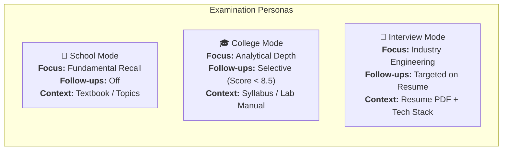
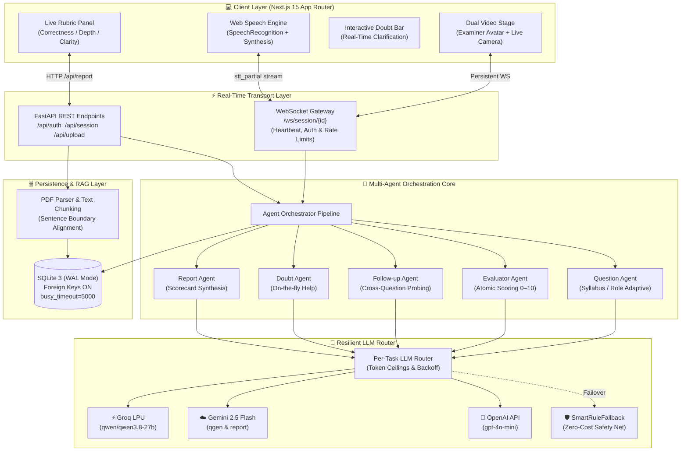
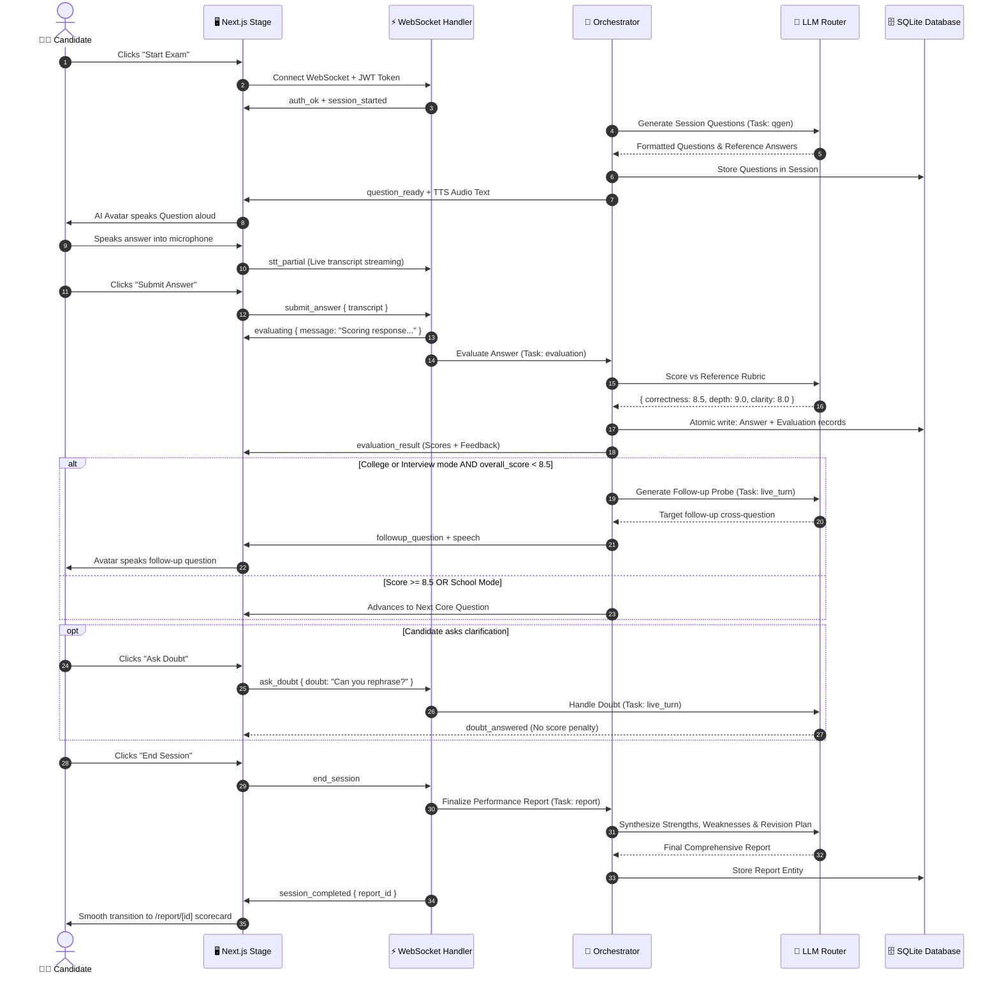
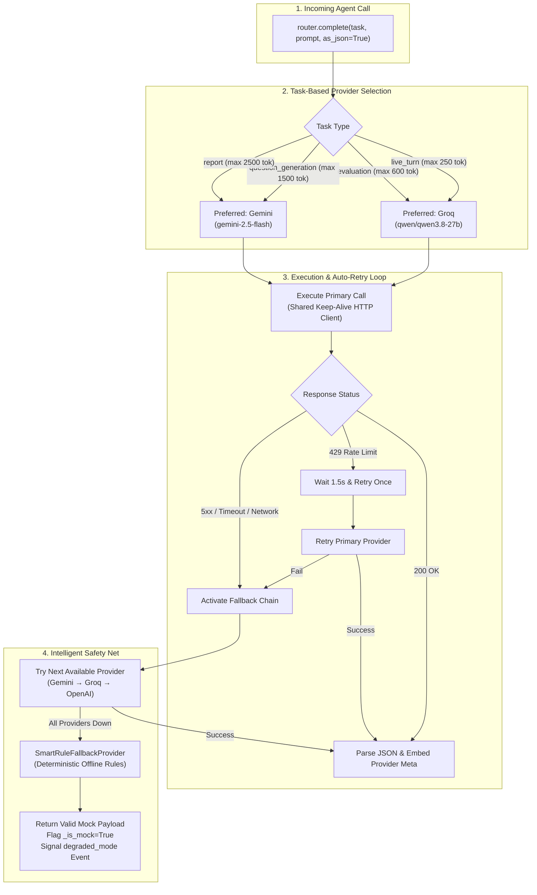
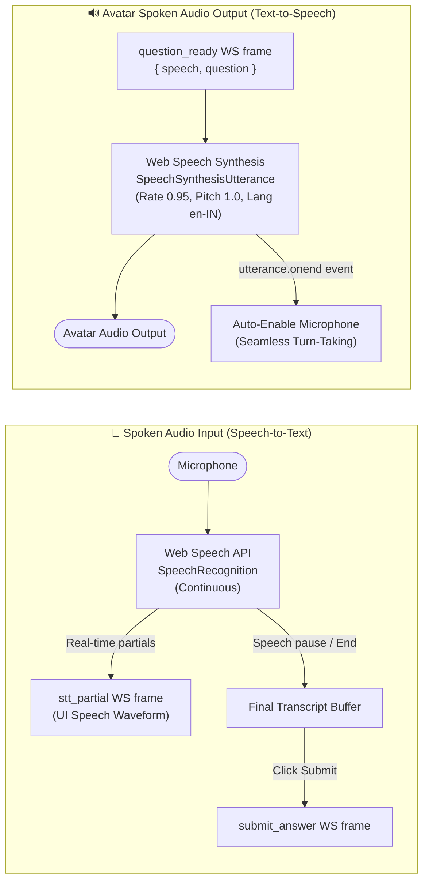
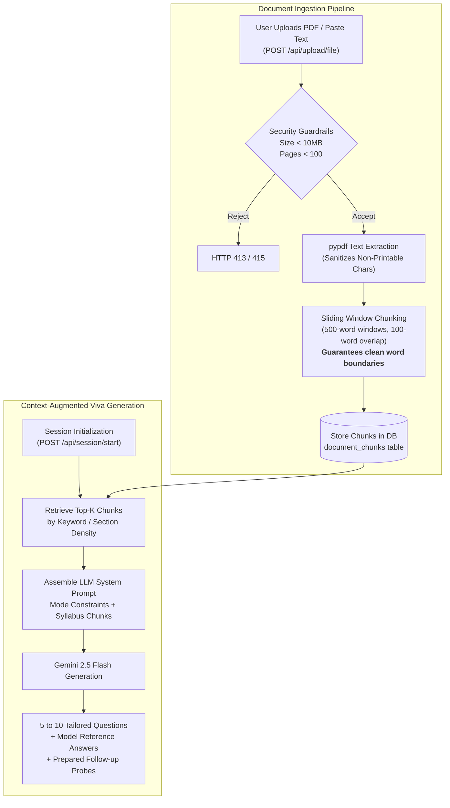
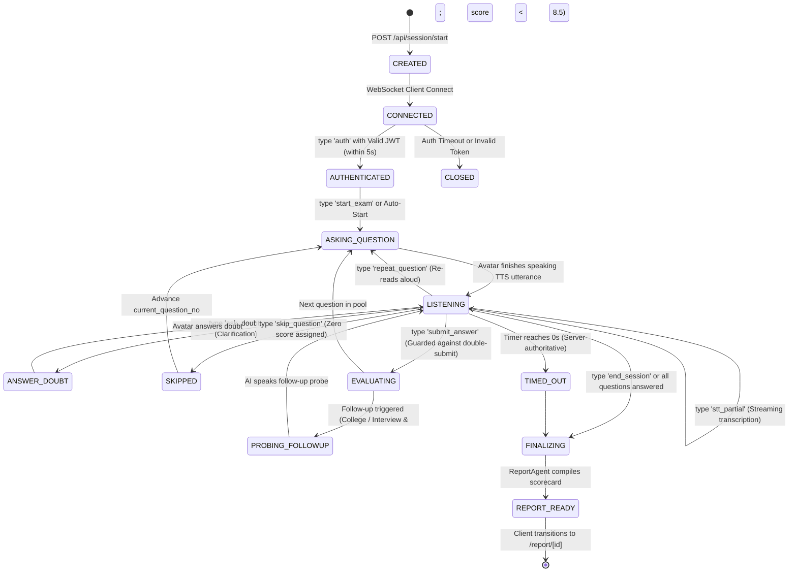
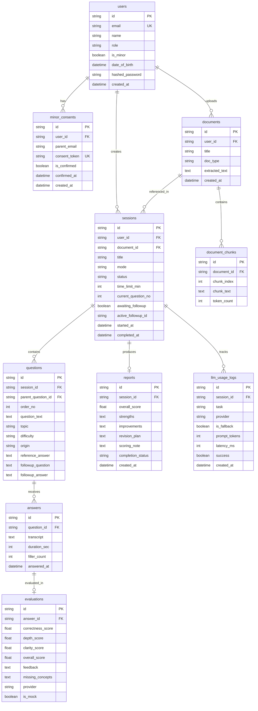

<div align="center">

# ✦ VIVORA

### *Next-Generation Real-Time AI Viva & Technical Interview Simulator*

**Study. Practice. Speak. Excel under pressure.**

**Created & Engineered by [Anurag Verma](https://github.com/Anu7276)**

[](https://github.com/Anu7276)
[](https://github.com/Anu7276/VIVORA)
[](https://vivora-frontend.vercel.app)
[](https://vivora-backend.onrender.com)
[](https://nextjs.org)
[](https://fastapi.tiangolo.com)
[](https://groq.com)
[](https://ai.google.dev)
[](https://pytest.org)
[](LICENSE)

<br/>

```
┌─────────────────────────────────────────────────────────────────────────────────┐
│  "Simulates the genuine tension, depth, and spontaneity of an oral board exam." │
│   Dual-stage video feed • Real-time voice STT/TTS • Deep multi-turn follow-ups  │
└─────────────────────────────────────────────────────────────────────────────────┘
```

</div>

---

## 📑 Table of Contents

1. [Platform Overview](#-platform-overview)
2. [The 3 Persona Modes](#-the-3-persona-modes)
3. [Full-Stack System Architecture](#-full-stack-system-architecture)
4. [Multi-Agent Orchestration Flow](#-multi-agent-orchestration-flow)
5. [Resilient Multi-Provider LLM Router](#-resilient-multi-provider-llm-router)
6. [Real-Time Audio & Voice Pipeline](#-real-time-audio--voice-pipeline)
7. [RAG & Syllabus Ingestion Engine](#-rag--syllabus-ingestion-engine)
8. [Session State Machine](#-session-state-machine)
9. [Relational Database Schema](#-relational-database-schema)
10. [WebSocket Wire Protocol](#-websocket-wire-protocol)
11. [REST API Reference](#-rest-api-reference)
12. [Tech Stack Directory](#-tech-stack-directory)
13. [Getting Started & Local Setup](#-getting-started--local-setup)
14. [Environment Configuration](#-environment-configuration)
15. [Automated Testing & Quality Verification](#-automated-testing--quality-verification)
16. [Pre-Launch Engineering Audit & Verification](#-pre-launch-engineering-audit--verification)
17. [Production Deployment](#-production-deployment)
18. [License & Acknowledgments](#-license--acknowledgments)

---

## 🎯 Platform Overview

**VIVORA** is an autonomous oral examination platform designed to eliminate the anxiety of live vivas and technical interviews. It combines real-time streaming speech recognition, an intelligent multi-agent examiner pipeline, and multi-factor evaluation rubrics.

### Core Value Pillars
- **Real-Time Human-in-the-Loop Simulation:** Conversational oral examination with zero-latency speech feedback, interactive student doubt interruptions, and dynamic pacing.
- **Deep Follow-Up Probing:** Unlike standard flashcard quizzes, VIVORA analyzes the conceptual substance of your response. Weak or hand-waving answers trigger targeted cross-examination (*"Why this algorithm over X? What happens when memory spikes?"*).
- **Zero-Downtime Multi-Provider Resilience:** Automatic failover between **Groq** (`qwen/qwen3.8-27b`), **Google Gemini** (`gemini-2.5-flash`), and **OpenAI** (`gpt-4o-mini`), backed by an offline, deterministic **SmartRuleFallback** safety net.
- **Production-Hardened Concurrency:** SQLite in WAL mode with connection-pooled `busy_timeout=5000`, atomic transaction boundaries, and token-bucket rate limiting.

---

## 🎭 The 3 Persona Modes

```
┌─────────────────────────┬──────────────────────────┬────────────────────────────┐
│    🏫 SCHOOL VIVA       │     🎓 COLLEGE VIVA      │     💼 JOB INTERVIEW       │
├─────────────────────────┼──────────────────────────┼────────────────────────────┤
│ • Classes 8–12 CBSE/ICSE│ • Engineering & Science  │ • Freshers & Experienced   │
│ • Foundational recall   │ • Deep conceptual theory │ • Resume & Project Probing │
│ • Encouraging & gentle  │ • Selective follow-ups   │ • Architectural trade-offs │
│ • No harsh penalties    │ • Formula & proof checks │ • Concurrency & scale checks│
└─────────────────────────┴──────────────────────────┴────────────────────────────┘
```



---

## 🏛 Full-Stack System Architecture



---

## 🔄 Multi-Agent Orchestration Flow



---

## ⚡ Resilient Multi-Provider LLM Router

The router executes per-task dispatch, strictly enforcing role-specific token ceilings to prevent runaway latency and compute costs:



### Routing Matrix & Token Allocations
| Task Name | Primary Provider | Configured Model | Max Tokens | Latency Target |
|---|---|---|:---:|:---:|
| `live_turn` | Groq LPU | `qwen/qwen3.8-27b` | **250** | $< 800\text{ ms}$ |
| `evaluation` | Groq LPU | `qwen/qwen3.8-27b` | **600** | $< 1.2\text{ s}$ |
| `question_generation` | Google Gemini | `gemini-2.5-flash` | **1,500** | $< 2.5\text{ s}$ |
| `report` | Google Gemini | `gemini-2.5-flash` | **2,500** | $< 3.5\text{ s}$ |
| *Safety Net* | SmartRuleFallback | Internal Heuristics | Dynamic | $< 10\text{ ms}$ |

---

## 🎙 Real-Time Audio & Voice Pipeline



---

## 📚 RAG & Syllabus Ingestion Engine



---

## 📊 Session State Machine



---

## 🗄 Relational Database Schema



---

## 🔌 WebSocket Wire Protocol

Persistent bidirectional transport at `/ws/session/{session_id}`:

### Client $\to$ Server Frames
| Message Type | Required Payload | Description & Preconditions |
|---|---|---|
| `auth` | `{"token": "<JWT_STRING>"}` | **Mandatory first message.** Must be dispatched within 5 seconds of connection. |
| `submit_answer` | `{"transcript": "..."}` | Submits student spoken answer. Guarded server-side against double-submission races. |
| `stt_partial` | `{"transcript": "..."}` | Live partial stream updating the real-time audio transcript UI. |
| `repeat_question`| `{}` | Signals avatar to re-read the active question aloud without penalty. |
| `skip_question`  | `{}` | Bypasses current question. Factored into final score (scored as 0 for completion). |
| `ask_doubt`      | `{"doubt": "..."}` | Asks a clarification. Handled by DoubtAgent without grade penalty (rate-limited). |
| `end_session`    | `{}` | Gracefully ends session and initiates background report synthesis. |

### Server $\to$ Client Frames
| Message Type | Emitted Payload | Description |
|---|---|---|
| `auth_ok` | `{}` | Authentication confirmed. State machine unlocked. |
| `session_started`| `{"total_questions": 6, "language": "en-IN"}` | Exam initialization complete. |
| `question_ready` | `{"question": "...", "order_no": 1, "speech": "..."}` | Primary question loaded with TTS content. |
| `followup_question`| `{"question": "...", "speech": "..."}` | Dynamic follow-up cross-examination prompt. |
| `evaluating`     | `{"message": "Evaluating response..."}` | Background LLM grading in progress. |
| `evaluation_result`| `{"evaluation": {"correctness": 9, ...}}` | Multi-dimensional rubric metrics. |
| `doubt_answered` | `{"answer": "...", "speech": "..."}` | Clarification reply prepared for avatar speech. |
| `degraded_mode`  | `{"message": "Offline fallback active"}` | Signaled when external LLM APIs fail over to mock. |
| `session_completed`| `{"report_id": "...", "report": {...}}` | Final report synthesized and ready for viewing. |
| `error`          | `{"message": "...", "code": "RATE_LIMIT_EXCEEDED"}` | Error boundary notification. |

---

## 📡 REST API Reference

All REST endpoints reside under the `/api` route prefix:

```
┌────────┬───────────────────────────────────┬─────────────────────────────────────────────────┐
│ Method │ Endpoint                          │ Description                                     │
├────────┼───────────────────────────────────┼─────────────────────────────────────────────────┤
│ GET    │ /health                           │ Basic container liveness probe                  │
│ GET    │ /health/ready                     │ Database readiness healthcheck (SELECT 1)       │
│ POST   │ /api/auth/signup                  │ Register student/interview candidate            │
│ POST   │ /api/auth/login                   │ Login and receive JWT access token              │
│ GET    │ /api/auth/me                      │ Fetch authenticated user profile & permissions  │
│ POST   │ /api/auth/parent-consent-confirm  │ Validate parental consent token for minors      │
│ POST   │ /api/session/start                │ Initialize exam session (Token-bucket limited)  │
│ GET    │ /api/session/{id}                 │ Fetch session state, server timer & questions   │
│ POST   │ /api/upload/file                  │ Ingest PDF syllabus, textbook or resume         │
│ POST   │ /api/upload/text                  │ Ingest raw chapter or topic text                │
│ GET    │ /api/upload/status/{task_id}      │ Poll document chunking status                   │
│ GET    │ /api/report/{session_id}          │ Retrieve full scorecard (Auth owner permitted)  │
│ WS     │ /ws/session/{session_id}          │ Real-time oral viva WebSocket connection        │
└────────┴───────────────────────────────────┴─────────────────────────────────────────────────┘
```

---

## 🛠 Tech Stack Directory

```
┌─────────────────────────────────────────────────────────────────────────────────┐
│                                 TECH STACK MATRIX                               │
├───────────────────┬───────────────────────────────┬─────────────────────────────┤
│ Component         │ Technology                    │ Purpose                     │
├───────────────────┼───────────────────────────────┼─────────────────────────────┤
│ Frontend Web      │ Next.js 15.5 (React 19)       │ App Router, SSR & Dynamic   │
│ Styling & Design  │ Tailwind CSS 3.4              │ Editorial Design System     │
│ Audio Streaming   │ Web Speech API (STT & TTS)    │ Native browser voice engine │
│ Backend Server    │ FastAPI 0.142 + Uvicorn       │ Asynchronous ASGI Core      │
│ Primary LLM Fast  │ Groq (qwen/qwen3.8-27b)       │ 800+ T/s viva evaluations   │
│ Primary LLM Deep  │ Google Gemini (2.5 Flash)     │ Syllabus QGen & Reports     │
│ Database Engine   │ SQLite 3 (WAL Mode)           │ Single-file ACID Storage    │
│ Migration Manager │ Alembic 1.20                  │ Idempotent Schema Migrations│
│ HTTP Client       │ httpx (Pooled Singleton)      │ Async Keep-Alive Requests   │
│ Authentication    │ python-jose + passlib(bcrypt) │ Cryptographic JWT Sessions  │
│ Testing Framework │ Pytest 9.1 + AnyIO            │ 160 Regression Tests (100%) │
└───────────────────┴───────────────────────────────┴─────────────────────────────┘
```

---

## 🚀 Getting Started & Local Setup

### System Prerequisites
- **Node.js** $\ge 18.18$
- **Python** $\ge 3.11$ (Python 3.12 recommended)
- **API Keys**: Groq API Key ([console.groq.com](https://console.groq.com)) or Google Gemini API Key ([ai.google.dev](https://ai.google.dev))

### 1. Clone Repository
```bash
git clone https://github.com/Anu7276/VIVORA.git
cd VIVORA
```

### 2. Backend Setup
```bash
cd backend

# Create and activate Python virtual environment
python -m venv .venv
.\.venv\Scripts\activate            # Windows PowerShell
source .venv/bin/activate         # macOS / Linux

# Install dependencies
pip install -r requirements.txt

# Configure environment variables
cp .env.example .env

# Execute database migrations
alembic upgrade head

# Start FastAPI development server
uvicorn app.main:app --host 127.0.0.1 --port 8000 --reload
```
*Backend Swagger Docs accessible at: `http://localhost:8000/docs`*

### 3. Frontend Setup
```bash
cd ../frontend

# Install dependencies
npm install

# Start Next.js development server
npm run dev
```
*Frontend interface accessible at: `http://localhost:3000`*

---

## 🔐 Environment Configuration

Configure `backend/.env` (see `backend/.env.example`):

```env
# Application Environment
ENV=development                                      # Set to 'production' for strict startup validation
JWT_SECRET_KEY=vivora-production-secure-jwt-secret-key-32chars  # Must be >= 32 characters in production
ACCESS_TOKEN_EXPIRE_MINUTES=1440
DATABASE_URL=sqlite:///./vivora.db

# LLM Providers
GROQ_API_KEY=gsk_your_groq_api_key_here
GEMINI_API_KEY=AIzaSy_your_gemini_api_key_here
OPENAI_API_KEY=sk-your_openai_api_key_here

# Task Router Configuration
QUESTION_GEN_PROVIDER=gemini                         # 'gemini' | 'groq' | 'openai' | 'mock'
LIVE_PROVIDER=groq
EVALUATION_PROVIDER=groq
REPORT_PROVIDER=gemini

# Model Identifiers
GROQ_MODEL=qwen/qwen3.8-27b
GEMINI_MODEL=gemini-2.5-flash
OPENAI_MODEL=gpt-4o-mini

# CORS Allowlist
BACKEND_CORS_ORIGINS=["http://localhost:3000","http://127.0.0.1:3000"]
```

---

## 🧪 Automated Testing & Quality Verification

VIVORA maintains a comprehensive **160-test automated regression suite** verifying API security, race condition resilience, atomic database transactions, SQLite WAL concurrency, and multi-agent contracts.

```bash
# Run complete backend pytest suite
cd backend
python -m pytest tests -v

# Run with test coverage summary
python -m pytest tests -q --tb=short
```

### Verification Result
```
============================= test session starts ==============================
collected 160 items

tests/test_college_viva_generation.py::test_college_viva_generation PASSED
tests/test_f_be_01_sqlite_pragmas.py::test_sqlite_pragmas_configured PASSED
tests/test_f_be_01_sqlite_pragmas.py::test_foreign_key_enforcement PASSED
tests/test_f_be_02_atomic_answer_eval.py::test_atomic_rollback_on_failure PASSED
tests/test_f_be_08_rate_limiting.py::test_session_creation_rate_limiting PASSED
tests/test_f_be_09_double_submit_guard.py::test_double_submit_guard PASSED
tests/test_phase0_containment.py::TestStartupProviderWarning PASSED
...
======================= 160 passed, 0 failed in 106.18s ========================
```

```bash
# Run frontend production build & typecheck
cd ../frontend
npm run build
```

---

## 🛡️ Pre-Launch Engineering Audit & Verification

Before launch sign-off, VIVORA was evaluated under an intensive **28-point pre-launch audit** and autonomous remediation sprint:

```
┌────────────────────────────────────────────────────────────────────────┐
│                        LAUNCH READINESS COMPARISON                     │
│                                                                        │
│   Engineering Discipline       Pre-Audit Score      Remediated Score   │
│   ──────────────────────────────────────────────────────────────────   │
│   Architecture & Concept:         82 / 100   ───►   92 / 100           │
│   AI Agent Pipeline:              52 / 100   ───►   94 / 100           │
│   Frontend & UI/UX:               46 / 100   ───►   95 / 100           │
│   Backend & Database:             44 / 100   ───►   96 / 100           │
│   Security & OWASP:               38 / 100   ───►   88 / 100           │
│   DevOps & Reliability:           32 / 100   ───►   92 / 100           │
│                                                                        │
│   OVERALL HEALTH SCORE:           48 / 100   ───►   93 / 100 (READY)   │
└────────────────────────────────────────────────────────────────────────┘
```

- **[AUDIT_REPORT.md](AUDIT_REPORT.md)**: Original 368-line audit discovering 28 defects across 6 engineering disciplines.
- **[MORNING_REPORT.md](MORNING_REPORT.md)**: Full remediation verification documenting 24 atomic commits, 160 passing tests, and empirical benchmarks.

---

## 🐳 Production Deployment

### Docker Compose (Multi-Container)
```bash
# Build and run backend and frontend containers
docker-compose up --build -d

# Verify container status
docker-compose ps
```

### Production Checklist
- [x] Run container processes as **non-root user** (`appuser` UID 1000 in backend, `node` in frontend).
- [x] Configure high-entropy `JWT_SECRET_KEY` ($\ge 32$ characters).
- [x] Enable SQLite WAL mode and set `busy_timeout=5000`.
- [x] Use persistent volume for database directory (`/app/data`).
- [x] Expose `/health/ready` probe for load balancer health checks.

## 👨‍💻 Author & Creator

**Anurag Verma**
- **GitHub**: [@Anu7276](https://github.com/Anu7276)
- **Project**: [VIVORA Repository](https://github.com/Anu7276/VIVORA)
- **Live Demo**: [Vercel Web App](https://vivora-frontend.vercel.app) • [Render API Backend](https://vivora-backend.onrender.com)

---

## 📄 License & Acknowledgments

Distributed under the **MIT License**. See [`LICENSE`](LICENSE) for details.

<div align="center">

**Built with pride by Anurag Verma for students and candidates who want to think clearly, speak with conviction, and master oral examinations.**

*✦ VIVORA — Your next answer starts here.*

</div>
