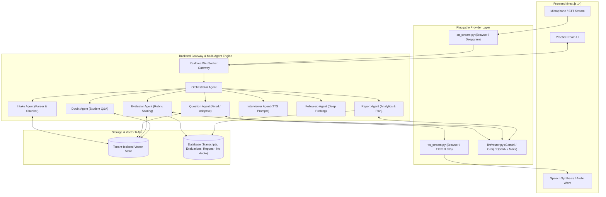
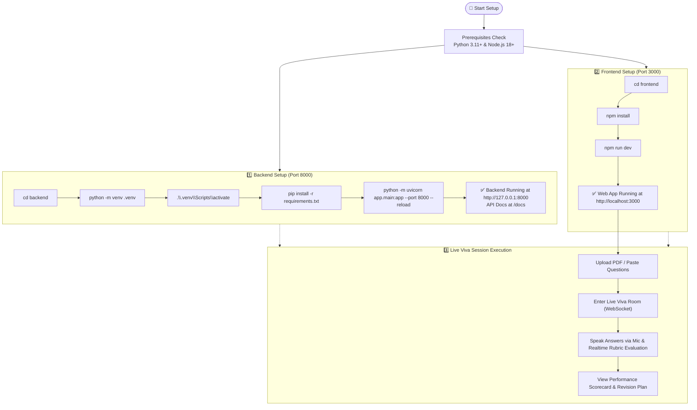

# 🎙️ VIVORA: AI Viva & Interview Simulator

> A live, voice-based AI interviewer and viva simulator. Upload a syllabus, textbook chapter, question list, or **PDF document**, answer questions aloud in real time, receive instant rubric evaluations, and get a detailed analytical revision report.

---

## 🚀 Key Features

- **3 Tailored Viva Modes**:
  - 🏫 **School Viva (Fixed)** ✅ *Working*: Friendly pace, reads uploaded questions in order, supports student voice doubts, and allows generous thinking pauses.
  - 🎓 **College Viva** ⚠️ *Partial*: Deep probing on "why" and "how" with follow-up questions to test conceptual understanding. Follow-up TTS is wired but untested in UI.
  - 💼 **Interview Prep** 🔧 *Stub*: Mode config and fixed-list path exist; filler-word penalty, adaptive difficulty, and comm-score computation not yet implemented.
- **📄 PDF & Material Ingestion (RAG)**:
  - Drag-and-drop PDF upload or paste text/questions.
  - Automatically parses pages, extracts structured questions/topics, and embeds chunks into a **tenant-isolated in-memory Vector DB**.
- **🎙️ Real-Time Spoken Interaction**:
  - Live Voice streaming with browser Web Speech API / WebAudio visualizer waveform.
  - Text-to-Speech (TTS) spoken questions with natural pronunciation and pitch.
  - Interruption & Barge-in support (speaking interrupts AI question playback).
  - Fallback **Manual Type / Edit** mode for noisy environments or browsers without microphone support.
- **🛡️ Strict Privacy by Design**:
  - **VIVORA servers never receive or store audio.** Audio handling depends on the STT provider (see Privacy table below).
  - ⚠️ **Browser STT caveat:** The browser's Web Speech API may send audio to the browser vendor (e.g. Google) for recognition; audio never reaches VIVORA servers. Chrome/Edge only — Firefox is not supported.
  - ⚠️ **Transcript data:** Student transcripts are sent to the configured LLM provider (Gemini, Groq, or OpenAI) for evaluation. Choose a provider whose data-processing terms are acceptable for your jurisdiction and student age group.
  - Only transcripts, question texts, duration, and rubric evaluations are stored in the VIVORA database. Audio is never stored anywhere.
- **📊 Comprehensive Performance Scorecard**:
  - Real-time scoring on **Correctness**, **Depth**, and **Speech Clarity**.
  - Summary scorecard with overall grade, key strengths, and prioritized **Revision Plan**.
  - Question-by-question breakdown comparing student transcripts against RAG model answers.
- **🔌 Per-Task LLM Routing**:
  - Each pipeline stage uses the best-fit provider — **question generation** (Gemini, runs once at session start), **live turn** follow-ups & doubts (Groq, real-time), **evaluation** rubric scoring (Groq, per-answer), and **final report** (Gemini, richer output).
  - Every provider is overridable by a single env var (`QUESTION_GEN_PROVIDER`, `LIVE_PROVIDER`, `EVALUATION_PROVIDER`, `REPORT_PROVIDER`) — no code changes needed.
  - Automatic fallback chain: primary → other configured provider → built-in mock. Rate-limit (429) errors back off and retry once before falling back.
  - When the router falls back to the **built-in mock**, the frontend receives a `degraded_mode` WebSocket event (banner), the evaluation is flagged `_is_mock=true`, and the final report includes a `scoring_note` labelling those scores as **rule-based estimates, not AI-scored**.
  - STT: `Browser` (Web Speech API) or `Deepgram`. TTS: `Browser` or `ElevenLabs`. All swappable by env var without touching agent logic.

---

## 🏗️ Multi-Agent Architecture



---

## 📂 Project Structure

```
VIVORA/
├── backend/
│   ├── app/
│   │   ├── agents/          # Multi-agent workers
│   │   │   ├── base.py
│   │   │   ├── orchestrator.py
│   │   │   ├── intake_agent.py
│   │   │   ├── question_agent.py
│   │   │   ├── interviewer_agent.py
│   │   │   ├── evaluator_agent.py
│   │   │   ├── doubt_agent.py
│   │   │   ├── followup_agent.py
│   │   │   └── report_agent.py
│   │   ├── api/             # REST routes & WebSocket Gateway
│   │   │   ├── routes/
│   │   │   │   ├── upload.py    # Text & PDF file upload
│   │   │   │   ├── session.py   # Session lifecycle
│   │   │   │   └── report.py    # Scorecard retrieval
│   │   │   └── ws/
│   │   │       └── interview_ws.py  # Live WebSocket loop
│   │   ├── core/            # Config, security, guardrails
│   │   ├── db/              # SQLAlchemy models & database connection
│   │   ├── llm/             # Pluggable LLM router & prompts
│   │   ├── rag/             # PDF parser, chunker, embedder, vector store
│   │   ├── services/        # Session state machine & ModeStrategy
│   │   ├── voice/           # STT stream, TTS stream, VAD & barge-in
│   │   └── main.py          # FastAPI application entrypoint
│   ├── tests/               # End-to-end integration tests
│   ├── requirements.txt
│   └── .env.example
├── frontend/
│   ├── src/
│   │   ├── app/
│   │   │   ├── page.tsx            # Setup, mode picker & PDF dropzone
│   │   │   ├── session/[id]/       # Live voice viva room
│   │   │   ├── report/[id]/        # Analytical scorecard & revision plan
│   │   │   ├── layout.tsx
│   │   │   └── globals.css
│   │   ├── components/      # AudioWave visualizer, Navbar
│   │   └── lib/             # API client, Web Speech voice helper
│   ├── package.json
│   ├── tailwind.config.js
│   └── tsconfig.json
├── infra/
│   └── docker-compose.yml
├── backend/
│   └── Dockerfile                      # Backend container image
├── .github/
│   └── workflows/
│       └── ci.yml
└── README.md
```

> **Production Status:** Fully integrated JWT authentication with calendar-accurate minor age detection and 48h TTL parental email consent; Alembic database migrations; production-grade Docker containerization for both backend and frontend; rate-limiting; duplicate WebSocket answer submission protection; and GDPR/DPDP Right-to-be-Forgotten cascading deletion (clearing sessions, questions, transcripts, database documents, and tenant vector indices).

---

## 📊 Mode Status

| Mode | Status | What works | Notes |
|---|---|---|---|
| 🏫 **School (Fixed)** | ✅ Working | Fixed question list, voice VAD, per-answer rubric, session cursor resume, doubt answering, time-limit enforcement | Requires login; minor users (<18) require parent consent token confirmation |
| 🎓 **College (Deep)** | ⚠️ Partial | Evaluation + follow-up question generation works end-to-end | Follow-up TTS speech wired; dynamic conceptual follow-ups active |
| 💼 **Interview Prep** | 🔧 Baseline | Mode config exists, structured technical questions run | Spoken communication analytics (filler words, pace, length, structure) active |

---

## ⚡ Quick Start



### 1. Prerequisites
- **Python 3.11+**
- **Node.js 18+** & **npm**

---

### 2. Backend Setup

```bash
# Navigate to backend directory
cd backend

# Create & activate virtual environment (Windows PowerShell)
python -m venv .venv
.\.venv\Scripts\activate

# Install dependencies
pip install -r requirements.txt

# Copy environment template and configure
copy .env.example .env
# Edit .env and add your GEMINI_API_KEY (or GROQ_API_KEY) for real AI scoring.
# Without a key, the server uses a rule-based mock that proves plumbing but not quality.

# Start FastAPI server on port 8000
python -m uvicorn app.main:app --port 8000 --host 127.0.0.1 --reload
```

- **Swagger API Docs**: [http://127.0.0.1:8000/docs](http://127.0.0.1:8000/docs)
- **API Health Check**: [http://127.0.0.1:8000/health](http://127.0.0.1:8000/health)

---

### 3. Frontend Setup

```bash
# In a new terminal, navigate to frontend directory
cd frontend

# Install packages
npm install

# Start Next.js development server on port 3000
npm run dev
```

- **Web Application**: [http://localhost:3000](http://localhost:3000)

---

### 4. Running Automated Tests

```bash
cd backend
.\.venv\Scripts\activate
# Run headless test harness
pytest tests/test_text_session_harness.py
# Test the complete end-to-end vertical slice
python tests/test_school_fixed_slice.py
# Test PDF parser
python tests/test_pdf_upload.py
# Test per-task LLM routing and fallback behaviour
pytest tests/test_task_routing.py -v
# Test degraded-mode flagging (mock fallback → _is_mock, scoring_note)
pytest tests/test_degraded_mode.py -v
```

---

## ⚙️ Configuration (`backend/.env`)

Copy `.env.example` to `.env` and fill in your API keys. Each task in the live pipeline uses its own LLM provider, chosen for the best speed/quality trade-off:

| Task | Default Provider | Env Var to Override | Why |
|---|---|---|---|
| **Question generation** | `gemini` | `QUESTION_GEN_PROVIDER` | Runs **once** at session start; Gemini handles long RAG context well |
| **Live turn** (follow-ups, doubt answers) | `groq` | `LIVE_PROVIDER` | Real-time; Groq's Llama is the fastest free-tier option |
| **Evaluation** (rubric scoring per answer) | `groq` | `EVALUATION_PROVIDER` | Called after every answer; low latency matters |
| **Report** (final scorecard) | `gemini` | `REPORT_PROVIDER` | Richer, multi-section summary; called once at end |

```ini
# API Keys
GEMINI_API_KEY=your_gemini_api_key
GROQ_API_KEY=your_groq_api_key
OPENAI_API_KEY=your_openai_api_key   # optional third fallback

# Per-task providers (gemini | groq | openai | mock)
QUESTION_GEN_PROVIDER=gemini
LIVE_PROVIDER=groq
EVALUATION_PROVIDER=groq
REPORT_PROVIDER=gemini

# Voice providers
STT_PROVIDER=browser
TTS_PROVIDER=browser
DEEPGRAM_API_KEY=your_deepgram_api_key
ELEVENLABS_API_KEY=your_elevenlabs_api_key

# Provider startup & fallback behavior
# When false (default), missing keys or unknown providers fail immediately at startup
ALLOW_STT_FALLBACK=false

# Database
DATABASE_URL=sqlite:///./vivora.db
```

> **Startup validation:** Unimplemented providers (such as `STT_PROVIDER=whisper`, which is planned) and unknown provider names fail immediately at application startup with a clear error rather than crashing mid-session. When `ALLOW_STT_FALLBACK=false`, missing keys (e.g. missing `DEEPGRAM_API_KEY`) halt startup instead of falling back silently.
>
> **LLM fallback order:** If the preferred provider returns an error or 429 rate limit, the router retries once with backoff, tries the other configured providers in order, and finally falls back to the built-in rule-based mock. If evaluation falls back to mock, the frontend receives a `degraded_mode` event, and the final report explicitly notes which questions received provisional mock scores.

---

## 🛡️ Privacy & Security

### Data in transit & at rest

| Layer | What happens | Who sees audio? | Stored in VIVORA DB? |
|---|---|---|---|
| **Browser STT** (`STT_PROVIDER=browser`) | Browser's Web Speech API recognises speech | Browser vendor (e.g. Google) — not VIVORA | ❌ Audio never reaches VIVORA servers |
| **Deepgram STT** (`STT_PROVIDER=deepgram`) ⚠️ *Stub* | Audio streams through VIVORA server RAM → Deepgram cloud | Deepgram cloud API | ❌ Written to RAM only, never disk |
| **Whisper STT** (`STT_PROVIDER=whisper`) 🔧 *Planned* | Audio stays fully inside VIVORA infrastructure (self-hosted model) | Nobody outside your server | ❌ Written to RAM only, never disk |
| **LLM evaluation** | Student transcript sent to Gemini/Groq/OpenAI for scoring | Configured LLM provider | ✅ Transcript stored in VIVORA DB; audio never stored |
| **Vector store** | Document chunks embedded in-memory, partitioned by tenant | Nobody external | ❌ Ephemeral in-memory |
| **Database** | Transcripts, scores, feedback, revision plan, session token | VIVORA DB only | ✅ Stored; audio never stored |

> ⚠️ **Third-Party Provider Deletion Notice (Important):** Data sent to third-party providers (such as browser vendors via Web Speech API, Deepgram for cloud STT, or Gemini/Groq/OpenAI for LLM evaluations) **cannot be deleted, purged, or revoked by VIVORA**. Their retention, logging, and model-training policies are governed entirely by those third parties. The `DELETE /api/report/{session_id}/data` endpoint deletes records stored on VIVORA infrastructure only.

> ⚠️ **Consent Gate (temporary, not a real safeguard):** To protect minors before a full authentication and parental consent system exists, `POST /api/session/start` applies a temporary block (HTTP 423) across **all viva modes**. Session creation is allowed only if the request supplies an authenticated `user_id` with a verified adult `date_of_birth` (age 18+) or a verified `parent_consents` record in the database. Client-supplied `is_minor` flags are explicitly untrusted and ignored.

### Session resume — what works and what doesn’t

- **Within a server process (implemented ✅):** `current_question_no` is persisted to the database after every answer. If the WebSocket drops and the student reconnects to the same running server, the session resumes from the last answered question.
- **Across server restarts (not implemented ❌):** The in-memory vector store is lost on restart. Re-ingestion of the document would be required before resuming. Alembic migrations and a persistent vector store are on the backlog.

### Data retention & deletion
 
| Data type | Retention / Lifecycle | Audio stored? | Purged on DELETE? |
|---|---|---|---|
| Session, questions & answers | Persisted in DB | ❌ Never | ✅ Yes (Hard delete) |
| Transcripts & rubric evaluations | Persisted in DB | ❌ Never | ✅ Yes (Hard delete) |
| Reports & topic scores | Cascade-deleted | ❌ Never | ✅ Yes (Hard delete) |
| LLM usage logs | Persisted in DB | ❌ Never | ✅ Yes (Hard delete) |
| Documents & Document Chunks | Persisted in DB | ❌ Never | ✅ Yes (Deleted if no other active sessions link to document) |
| Retriever / BM25 In-Memory Indices | In-memory tenant cache | ❌ Never | ✅ Yes (Cache evicted on document ID) |
| Audio | Never stored | — | — |

**Per-session secret token:** Every session generates a cryptographically random 32-byte (64-character hex) token at creation. This token is required for report retrieval (`GET /api/report/{session_id}`) and data deletion (`DELETE /api/report/{session_id}/data`) via the `X-Session-Token` HTTP header (or query param). Missing or mismatched tokens are rejected with **403 Forbidden**.

**Delete-my-data endpoint (fully implemented ✅):**
```http
DELETE /api/report/{session_id}/data
X-Session-Token: {session_token}
Authorization: Bearer {jwt_token}
```
Permanently purges the session, questions, transcripts, evaluations, reports, topic scores, LLM usage logs, unshared Document/DocumentChunk records, and clears the tenant vector/BM25 cache. Returns `{"deleted": true, "session_id": "...", "documents_deleted": [...]}`.

---

## 📄 License

MIT License © 2026 VIVORA AI
