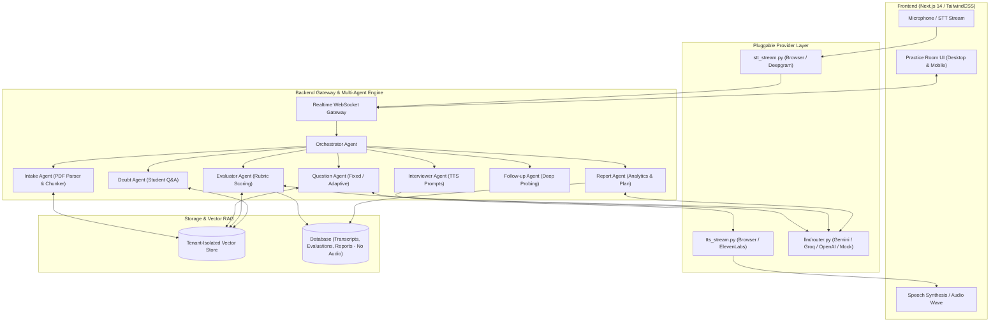
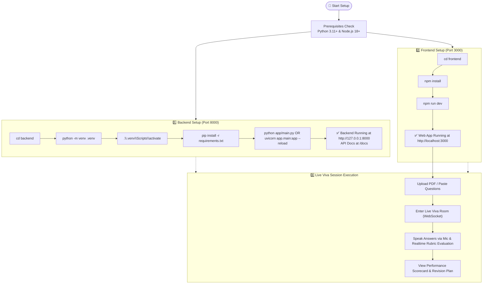

# 🎙️ VIVORA: AI Viva & Interview Simulator

> A state-of-the-art, voice-driven AI interviewer and viva examination simulator. Ingest syllabi, textbook chapters, custom question banks, or **PDF documents**, converse dynamically with AI examiners in real-time speech, receive instant multi-metric rubric evaluations, and generate comprehensive analytical revision reports.

---

## 🎨 UI/UX Design (Powered by Google Stitch)

High-fidelity designs crafted with the **Obsidian Telemetry HUD** design system for both Desktop and Mobile viewports.

### 🖥️ Desktop Cockpit View


* **12-Column Telemetry Deck**: Persistent examination stream, RAG context inspector, and real-time rubric gauge sidebar.
* **Neural Examiner Card**: Real-time AI voice frequency oscilloscope with dynamic voice activity indicator.
* **Live Assessment Gauges**: Instant visual scoring across **Correctness (50%)**, **Technical Depth (30%)**, and **Speech Clarity (20%)**.

---

### 📱 Mobile Experience


* **Compact Telemetry Header**: Displays question progress (`Q3/10`), latency metrics (`14ms OPT`), and session timer (`18:42`).
* **Tactile Floating Voice Dock**: One-tap pulsing microphone button (`TAP TO TRANSMIT / MUTE`), instant Doubt clarification trigger, and protected session termination.
* **Collapsible Whisper STT Feed**: Live speech-to-text candidate stream with decibel level monitoring.

---

## 🔑 Required APIs & Environment Keys

VIVORA uses a pluggable, multi-agent architecture with per-task routing. Below is the full breakdown of required and optional APIs:

| API Key | Provider | Purpose / Pipeline Stage | Required? | Free Tier Available? | Where to Obtain |
|---|---|---|---|---|---|
| `GEMINI_API_KEY` | Google Gemini (`gemini-2.5-flash`) | **Question Generation** (RAG ingestion) & **Final Session Reports** | **Recommended** | ✅ Yes (Generous free tier via Google AI Studio) | [Google AI Studio](https://aistudio.google.com/) |
| `GROQ_API_KEY` | Groq (`llama-3.1-8b-instant`) | **Live Turn** (real-time follow-ups & doubt resolution) & **Per-Answer Evaluation** | **Recommended** | ✅ Yes (Fast & free tier at Groq Console) | [Groq Cloud Console](https://console.groq.com/) |
| `OPENAI_API_KEY` | OpenAI (`gpt-4o-mini`) | Optional multi-provider fallback for all LLM stages | Optional | ❌ Pay-as-you-go | [OpenAI Platform](https://platform.openai.com/) |
| `ELEVENLABS_API_KEY` | ElevenLabs | High-quality Neural Text-to-Speech (TTS) voice examiner | Optional (defaults to browser TTS) | ✅ Yes (Free tier credits) | [ElevenLabs](https://elevenlabs.io/) |
| `DEEPGRAM_API_KEY` | Deepgram | Cloud Speech-to-Text (STT) for server-side audio transcription | Optional (defaults to browser Web Speech API) | ✅ Yes ($200 free credit) | [Deepgram Console](https://console.deepgram.com/) |

> 💡 **Default Zero-Cost Setup**: By default, VIVORA uses **Browser Web Speech API** for STT and **Browser SpeechSynthesis** for TTS, requiring **zero voice API keys**. Adding just a `GEMINI_API_KEY` or `GROQ_API_KEY` gives you the full AI-powered examination pipeline. If no API keys are provided, VIVORA operates in built-in **Mock mode** for testing.

---

## 🚀 Key Features

- **3 Tailored Viva Modes**:
  - 🏫 **School Viva (Fixed)**: Structured pace, sequential question progression, student voice doubt clarification, and generous thinking pauses.
  - 🎓 **College Viva (Adaptive Deep Probing)**: In-depth conceptual interrogation ("why" and "how") with dynamic follow-up probing.
  - 💼 **Interview Prep**: Professional tech screening with spoken communication metrics (filler word penalty, pacing WPM, structured responses).
- **📄 RAG Document Ingestion**:
  - Drag-and-drop PDF upload, syllabus paste, or custom question bank ingestion.
  - Automatically segments chapters, extracts key concepts, and embeds chunks into a tenant-isolated vector store.
- **🎙️ Real-Time Voice Pipeline**:
  - Live voice streaming with browser Web Speech API / WebAudio visualizer waveform.
  - Natural AI voice examiner with dynamic question pacing.
  - Interruption & Barge-in support (speaking pauses examiner audio playback).
  - Manual text fallback mode for low-noise/no-mic environments.
- **📊 Granular Performance Scorecard**:
  - Real-time scoring on **Correctness (50%)**, **Depth (30%)**, and **Clarity (20%)**.
  - Final summary scorecard with overall grade, identified gaps, and an actionable **Prioritized Revision Plan**.
- **🛡️ Strict Privacy by Design**:
  - Audio never leaves your client machine when using Browser STT/TTS. VIVORA servers never record, store, or persist raw audio files.
  - Full GDPR/DPDP Right-to-be-Forgotten data deletion endpoint (`DELETE /api/report/{session_id}/data`).

---

## 🏗️ Multi-Agent Architecture



---

## ⚡ Quick Start



### 1. Prerequisites
* **Python 3.11+** (Python 3.12 supported)
* **Node.js 18+** & **npm**

---

### 2. Backend Setup

```bash
# 1. Navigate to backend
cd backend

# 2. Create and activate virtual environment (Windows PowerShell)
python -m venv .venv
.\.venv\Scripts\activate

# 3. Install dependencies
pip install -r requirements.txt

# 4. Configure environment
copy .env.example .env
# Edit .env and paste your GEMINI_API_KEY and/or GROQ_API_KEY

# 5. Start the backend server (any of these methods work)
python app/main.py
# OR from repository root:
python backend/app/main.py
# OR with uvicorn:
uvicorn app.main:app --host 127.0.0.1 --port 8000 --reload
```

* **Swagger API Documentation**: [http://127.0.0.1:8000/docs](http://127.0.0.1:8000/docs)
* **Health Check**: [http://127.0.0.1:8000/health](http://127.0.0.1:8000/health)

---

### 3. Frontend Setup

```bash
# In a new terminal window:
cd frontend

# Install Node dependencies
npm install

# Start Next.js development server
npm run dev
```

* **Web Application**: [http://localhost:3000](http://localhost:3000)

---

### 4. Running Automated Tests

```bash
cd backend
.\.venv\Scripts\activate

# Run end-to-end vertical slice test
python tests/test_school_fixed_slice.py

# Run PDF parsing test
python tests/test_pdf_upload.py

# Run per-task LLM routing & fallback test
pytest tests/test_task_routing.py -v

# Run degraded-mode & mock evaluation test
pytest tests/test_degraded_mode.py -v
```

---

## 📂 Project Structure

```
VIVORA/
├── backend/
│   ├── app/
│   │   ├── agents/          # Multi-agent workers (Intake, QA, Interviewer, Evaluator, Doubt, Followup, Report)
│   │   ├── api/             # REST routes (auth, upload, session, report) & WebSocket Gateway
│   │   ├── core/            # Config, security, guardrails, JWT auth
│   │   ├── db/              # SQLAlchemy models & SQLite/Postgres connection
│   │   ├── llm/             # Pluggable LLM router & prompts (Gemini, Groq, OpenAI, Mock)
│   │   ├── rag/             # PDF parser, chunker, embedder, tenant vector store
│   │   ├── services/        # Session state machine & ModeStrategy
│   │   ├── voice/           # STT stream, TTS stream, VAD & barge-in
│   │   └── main.py          # FastAPI application entrypoint
│   ├── tests/               # End-to-end integration & unit tests
│   ├── requirements.txt
│   └── .env.example
├── frontend/
│   ├── src/
│   │   ├── app/
│   │   │   ├── page.tsx            # Setup, mode picker & PDF dropzone
│   │   │   ├── session/[id]/       # Live voice viva room
│   │   │   ├── report/[id]/        # Analytical scorecard & revision plan
│   │   │   ├── layout.tsx
│   │   │   └── globals.css
│   │   ├── components/      # AudioWave visualizer, Navbar, Telemetry gauges
│   │   └── lib/             # API client, Web Speech voice helper
│   ├── package.json
│   ├── tailwind.config.js
│   └── tsconfig.json
├── infra/
│   └── docker-compose.yml
└── README.md
```

---

## 📄 License

MIT License © 2026 VIVORA AI
